# 🧪 Вся химия с нуля до ЕГЭ за 12 часов — полный конспект марафона

> **Что это за конспект.** Это подробная текстовая «расшифровка» открытого 12-часового марафона школы **Профиматика** (преподаватель — **Владислав Кварц**). Марафон покрывает всю химию 8–11 класса — от базовых понятий до заданий ЕГЭ, — и конспект идёт строго в том же порядке, что и занятие.
>
> **Как читать.** Рядом с заголовками стоят плашки `▶ 0:25:49` — это ссылки: клик открывает соответствующий момент в видео на YouTube (смотри видео и конспект параллельно). Картинки кликабельны — открываются в полном размере. Слева — оглавление и кнопка **«Скачать PDF»** (печать всей страницы). Блоки-выноски помечают важное: ⚡ — ключевое для экзамена, ⚠️ — типичная ошибка, 📝 — задача/практика, 💡 — лайфхак.

**Марафон:** «Вся химия с нуля и до ЕГЭ за 12 часов» · 27.09.2026 · длительность 11:54:32
**Ссылка на видео:** https://www.youtube.com/live/s4d9DKnlCpE

---

## 🎬 0. Вводная часть: преподаватель, курс и стратегия подготовки [tt:0:02:20]

### Преподаватель

Владислав Кварц — преподаватель химии с 8-летним опытом подготовки к ЕГЭ, ОГЭ и олимпиадам.

- **6 раз сам сдал ЕГЭ по химии на 100 баллов**, среди его учеников — 85+ высокобалльников.
- Действующий **научный сотрудник**: пишет статьи, участвует в конференциях и научных проектах. Благодаря этому на занятиях разбираются не только «школьные» факты, но и реальная современная химия — и отмечаются места, где наука и формат ЕГЭ расходятся (на экзамене важно отвечать так, как требует ЕГЭ).

### Школа «Профиматика»

- 150 000+ учеников прошли через школу; **более 50 % сдали ЕГЭ на 80+**, средний балл среди всех предметов в 2026 году — выше 80.
- Преимущества: преподаватели — **реальные эксперты ЕГЭ**, многократно сдававшие экзамен; **индивидуальная траектория** (вначале глубокое тестирование → маршрут до цели с чётким числом занятий, домашек и пробников — отдельно для цели «70–80» и отдельно для «90–100»); **устные зачёты без подготовки** (вытянул билет — сразу ответ; цель не «завалить», а найти пробелы); **бесплатный банк задач** `bank-zadach.ru` (задания 1-й и 2-й части из банка ФИПИ, ключи есть, пояснения добавляются).
- Формат занятий: теория и практика перемешаны (прошли теорию → сразу практика → в домашке похожие задания).

### Стратегия подготовки (советы со стрима)

- 100 баллов — это в первую очередь **результат ученика**: без мотивации и работы никакой преподаватель не поможет.
- **Системность и регулярность**, а не «неделю позанимался — неделю отдохнул». Заниматься каждый день не обязательно — важна регулярность и чёткое прохождение тем.
- Темы идут **строго в определённом порядке**: общая химия → органика → химия элементов. Органику и химию элементов можно менять местами: если в 10 классе органику «забили» — начинайте с органики, чтобы успеть её качественно отработать.
- **Незнакомое понятие разбирайте сразу** («потом пойму» не работает — забудете, что вообще было непонятно).
- Задания второй части включайте **с самого начала обучения**: 27 → 29 → 31 → 32 → 33 → 34. По 34-й задаче: сначала математика (системы уравнений, пропорции, дроби), затем терминология (обжиг, прокаливание, навеска, аликвота), затем инструменты (последовательные и параллельные превращения, альтернативные реакции, масса конечного раствора, кто реагирует первым) — только потом сами задачи. Осенью у курса будет отдельный интенсив по 34-й задаче.

> ⚡ **Про ЕГЭ-2027.** Экзамен не стал ни сложнее, ни легче — он остался на том же уровне, и прежние инструменты подготовки работают. Не верьте запугиваниям в соцсетях. Единственное, за чем стоит следить, — **осенний вебинар составителей ЕГЭ**: там уточняют тонкости по конкретным заданиям (например, задание 26 — молярная концентрация; задание 23 — вычисление массы/объёма участника реакции).

Также в конце стрима — розыгрыш 3 мест (по месяцу обучения) на годовом курсе; скидки для зрителей: 10 % по QR-коду во время стрима и 7 % — по записи.

---

## 1. Основные понятия химии [tt:0:25:49]

- **Физическое тело** — всё, что нас окружает (стакан, калькулятор, стол…). Каждое тело состоит из одного или нескольких **веществ**.
- У каждого вещества есть **свойства** — признаки, которые его характеризуют:
  - *физические*: температуры кипения и плавления, цвет, плотность, магнитные свойства;
  - *химические*: способность вступать в те или иные реакции.
- **Химическое явление** (химическая реакция) — процесс, в котором **обязательно образуются новые вещества**. Именно этот признак отличает химическое явление от физического.
- **Физические явления** — плавление, испарение, конденсация и т. п. (меняется агрегатное состояние, но новых веществ не появляется).
- **Химия** — наука о веществах, их свойствах и превращениях (школьное определение, лаконичное и не на 100 % полное).
- Современная химия — это **более 100 дисциплин**: физическая, коллоидная, аналитическая, радиохимия и др. Отдельно упоминается **хемофобия** — страх «химии и химикатов», с которым будущим химикам и медикам приходится бороться.

---

## 2. Агрегатные состояния и нормальные условия [tt:0:31:14]

📝 **Интерактив из стрима:** верно ли, что «вода — это жидкость, а кислород — это газ»?
**Ответ: неверно** — потому что не указаны условия! Кислород бывает и жидким, и твёрдым (при сверхнизких температурах и высоком давлении), вода — и твёрдой, и газообразной.

| Состояние | Как расположены частицы | Свойства |
|---|---|---|
| **Газ** | молекулы максимально далеко друг от друга, расстояние между ними значительно больше размеров самих молекул, взаимодействие слабое | сжимается и расширяется; **занимает весь предоставленный объём** |
| **Жидкость** | частицы ближе, взаимодействие заметно сильнее | течёт, принимает форму сосуда; переход газа в жидкость — **конденсация** (например, повышением давления) |
| **Твёрдое** | упорядоченная структура, самые сильные взаимодействия, частицы максимально близко | **не сжимается**, нетекучее |

- Агрегатное состояние влияет на химическую активность: с газами реакции, как правило, идут быстрее (подробно — в теме «Скорость химической реакции»).
- Смена агрегатного состояния — **физическое** явление, а не химическое.

**Нормальные условия (н. у.)** — «точка опоры» в химии:

- давление **1 атм = 101,325 кПа**;
- температура **0 °C**.

Есть и **стандартные условия** — то же самое, но температура **25 °C** (в школьном курсе их почти не используют). Поэтому говорить «вода — жидкость» корректно только с добавлением «при нормальных условиях».

---

## 3. Чистые вещества и смеси. Способы разделения смесей [tt:0:37:55]

- **Абсолютно чистых веществ в природе практически нет** — везде есть примеси. Есть даже градация по чистоте: *особо чистые* (ос. ч.), *химически чистые* (х. ч.), *чистый для анализа* (ч. д. а.).
- **Смеси** бывают:
  - **гомогенные** — границы раздела не видны (пример — **воздух**: смесь N₂, O₂, CO₂, Ar и др.);
  - **гетерогенные** — частицы компонентов и границы раздела видны невооружённым глазом или в оптический прибор (пример — **стиральный порошок** с цветными крапинками).
- По агрегатному состоянию смеси делят на твёрдые, жидкие и газообразные. Понятия «гомогенная/гетерогенная» ещё пригодятся в теме скорости химических реакций.

### Способы разделения смесей

| Смесь | Метод | На чём основан |
|---|---|---|
| Гетерогенная (вода + песок, ил) | **Фильтрование** | разный размер частиц: молекулы воды проходят через поры фильтра, частицы песка — нет |
| Гетерогенная | **Отстаивание** | разная плотность: тяжёлые частицы оседают на дно, жидкость сливают |
| Гетерогенная (частицы железа) | **Магнитная сепарация** | магнитные свойства компонента |
| Гомогенная | **Хроматография** | разное сродство веществ к подвижной и неподвижной фазам (вещества «любящие» подвижную фазу уходят с ней дальше) |
| Гомогенная (раствор соли) | **Выпаривание / кристаллизация** | разная температура кипения: вода выкипает, соль остаётся кристаллами (пример — накипь/налёт NaCl после выкипания солёной воды) |
| Гомогенная жидкая (вода + спирт) | **Дистилляция (перегонка)** | разная температура кипения: один компонент испаряется первым, его пары конденсируются в холодильнике и стекают в приёмник (дистиллят) |

💡 Хроматография — один из самых мощных физико-химических методов разделения; дорогие пластинки можно заменить обычной бумагой. Вопрос про хроматографию встречается и в ЕГЭ по биологии.

---

## 4. Атомно-молекулярное учение [tt:0:46:52]

**История и модели атома.** Демокрит (Древняя Греция) считал атом неделимым и «тем, из чего состоит всё». Позже появились модели Томсона, Резерфорда, планетарная модель. **Современные представления: атом устроен НЕ как солнечная система** — он гораздо сложнее, и точно описать происходящее внутри атома наука пока не может; нынешняя модель со временем тоже может измениться.

**Масштабы.** На кончике швейной иглы — миллиарды атомов. Слово «молекула» происходит от латинского *moles* («масса») с уменьшительным суффиксом — «что-то очень маленькое»; понятие ввёл французский учёный.

**Химический элемент** — определённый вид атомов. Известно **118 химических элементов** (118 видов атомов), но в природе встречается лишь около **90**; элементы после 90-го получены искусственно.

**Основные положения атомно-молекулярного учения** («конституция химии»):

1. Вещества состоят из молекул, которые находятся в непрерывном движении. ⚠️ Современное уточнение: **не все вещества состоят из молекул** (об этом — в теме химической связи).
2. **Молекула** — мельчайшая частица вещества, которая **определяет его химические свойства** (ключевая концовка определения: свойства молекулы переносятся на всё вещество).
3. Молекулы состоят из **атомов**. Атом — наименьшая *химически* неделимая частица. ⚠️ Уточнение: атом делим — он состоит из протонов, нейтронов и электронов, а те — из ещё более простых частиц (кварков).
4. При химических реакциях исходные вещества разрушаются **до атомов**: старые связи рвутся, образуются новые связи и новые соединения.

**Теория витализма** («vis» — жизнь): считалось, что органические вещества может создавать только живой организм, а у человека нет «жизненной силы» для их синтеза. Теория опровергнута: из неорганических веществ получили органические — **мочевину** и **щавелевую кислоту**.

> 💡 Физика постоянно «помогала» химии: радиоактивность, дифракция, интерференция, квантовая механика пришли из физики и объяснили химические явления. Но химия — **отдельная дисциплина**, а не раздел физики.

---

## 5. Простые и сложные вещества. Аллотропия [tt:0:52:00]

- **Простые вещества** состоят из атомов **одного** химического элемента; **сложные** — из атомов **разных** элементов. Сложные бывают бинарными (два элемента: H₂O, CO₂, CH₄) и состоящими из трёх, четырёх и более элементов.
- Сложных веществ **более 100 млн** (в основном органических), простых — **более 400**.
- Причина: у одного элемента может быть несколько простых веществ. **Аллотропия** — способность одного химического элемента образовывать разные простые вещества.

**Примеры аллотропии:**

| Элемент | Модификации | Особенности |
|---|---|---|
| **Кислород** | O₂ и O₃ (озон) | O₂ — наиболее устойчивая форма, нужна для жизни; O₃ — менее стабилен, но именно он образует озоновый слой и защищает от жёсткого УФ-излучения. Переходят друг в друга, например, при грозовом разряде (отсюда запах «свежести» после дождя) |
| **Углерод** | алмаз, графит, фуллерен, карбин, нанотрубки (всего 10+ модификаций) | алмаз — прозрачный, не проводит ток; графит — слоистый, проводит ток, легко «расслаивается» (стержень карандаша). Различие — в **строении**: у графита слои шестиугольников соединены слабыми межмолекулярными взаимодействиями («торт Наполеон»), у алмаза — жёсткая каркасная структура |
| **Фосфор** | белый, красный, чёрный, металлический, фиолетовый | белый фосфор — сильнейший яд; модификации отличаются и физическими, и химическими свойствами |

💡 **Фуллерен C₆₀** — полая молекула-«футбольный мяч» из чередующихся пяти- и шестиугольников (бывают и C₂₀, C₃₀, C₄₀, C₇₀…). В научной работе преподавателя фуллерены используют как «ловушку» для радионуклидов (прячут опасное вещество от клеток) и как защитный «скафандр» для лекарственных молекул, которые иначе разрушаются, например, в желудочно-кишечном тракте.

> ⚠️ Не путайте **аллотропию** и **изомерию**: аллотропия — про разные простые вещества одного элемента (общая химия, неорганика), изомерия — про органические вещества и их строение.

---

## 6. Ионы [tt:1:09:06]

- **Ионы** — положительно или отрицательно **заряженные** частицы, которые образуются из атомов или групп атомов.
- Ионы бывают **простыми** (из атомов одного элемента: Na⁺, S²⁻) и **сложными** (NH₄⁺, SO₄²⁻).
- ⚡ Ключевое отличие: **атомы и молекулы заряда не имеют** — заряжены только ионы.

**Почему не все вещества состоят из молекул.** Поваренная соль NaCl — не «атомы натрия + атомы хлора», а упорядоченная структура из **катионов Na⁺ и анионов Cl⁻**, связанных ионной связью. В реальной решётке рядом с каждым катионом натрия находится **шесть** хлорид-ионов (и наоборот) — соотношение **6 : 6**. Запись «NaCl» — это упрощение, которое показывает лишь соотношение 1 : 1. Поэтому говорят о **немолекулярном строении** (ионном, атомном) у солей, гидроксидов и т. п.

---

## 7. Названия и символы химических элементов [tt:1:12:36]

Химические элементы — это «азбука химии»: из них строятся все вещества и записи формул и уравнений.

- Символ элемента — обычно **первая буква латинского названия** (H — hydrogenium, O — oxygenium).
- Если первая буква уже «занята» другим элементом, берут **следующую**: N — это азот (nitrogenium), поэтому натрий — **Na** (natrium), неон — **Ne**; O — кислород (oxygenium), поэтому осмий — **Os**. Если заняты две буквы — берут третью.
- **Название и произношение часто не совпадают**, особенно у «древних» металлов и неметаллов:

| Формула | Название элемента | Произношение символа |
|---|---|---|
| Fe | железо | феррум |
| Cu | медь | купрум |
| Ag | серебро | аргентум |
| Au | золото | аурум |
| Pb | свинец | плюмбум |
| Sn | олово | станум |
| Hg | ртуть | гидраргирум |
| Sb | сурьма | стибиум |
| As | мышьяк | арсеникум |
| N, Si, S, P, Cl | азот, кремний, сера, фосфор, хлор | эн, силициум, эс, пэ, хлор |

⚠️ Читать формулы нужно правильно: индекс за скобкой произносится как «дважды/трижды»: Ca(OH)₂ — «кальций-о-аш-дважды», Al(NO₃)₃ — «алюминий-эн-о-три-трижды» (а не «кальций-о-аш-два»).

**Из истории и современности:**

- 118-й элемент **оганесон** открыт российскими учёными в **Дубне**; элементы после 90-го в природе не встречаются — их получают искусственно (ядерными превращениями).
- Система будет дополняться (119, 120 — кандидаты), но рано или поздно синтез остановится: сверхтяжёлые атомы слишком нестабильны.
- Единой стратегии в названиях нет: есть отсылки к учёным (резерфордий), к странам и местам (галлий — старое название Франции, рутений).

---

## 8. Относительная атомная масса [tt:1:22:37]

- Абсолютные массы атомов ничтожно малы (порядка 10⁻²⁶–10⁻²⁷ кг) — считать в килограммах крайне неудобно.
- Поэтому приняли **относительные** величины: сравнение с эталоном (как относительная скорость в физике).
- **Дальтон** предложил сравнивать массы атомов с массой атома водорода: один атом углерода «весит» как 12 атомов водорода, кислород — как 16, азот — как 14.
- **Относительная атомная масса Aᵣ** (r — от англ. *relative*) — **безразмерная** величина; показывает, **во сколько раз масса атома больше массы атома водорода**.

> ⚡ Запомните: Aᵣ (и дальше Mᵣ) — **безразмерные** величины, никаких «г/моль» у них нет. Граммы на моль появятся только у молярной массы.
>
> ❓ Почему в таблице Менделеева Aᵣ — не целые числа (например, 35,5 у хлора)? Ответ — в теме «Изотопы»: там же разберём, откуда берутся дробные значения.

---

## 9. Практика: «простое вещество» или «химический элемент» (задание 1 ОГЭ) [tt:1:27:48]

💡 **Главный приём.** Читая утверждение, попробуйте **нарисовать картинку**:

- **Простое вещество** — можно представить «вживую»: как вещество реагирует, какие у него физические свойства, как его получают (глаголы «получен», «реагирует», «выделяется»).
- **Химический элемент** — вещество **входит в состав** чего-либо; представить картинку нельзя («в состав мела входит кальций», «поваренная соль содержит хлор»).

**Разбор задания про хлор** (нужно выбрать утверждения о хлоре как о простом веществе):

- ✅ «Хлор — сильный окислитель, реагирует с сульфитами, сульфидами, иодидами, реагирует даже с золотом» — простое вещество (химические свойства).
- ✅ «Хлор — жёлто-зелёный газ» — простое вещество (физические свойства).
- ❌ «Поваренная соль содержит хлор», «хлор входит в состав минерала» — это про химический элемент: хлор в составе, «увидеть» его нельзя.

**Разбор задания про кальций** (выбрать утверждения о кальции как о химическом элементе) — правильный ответ 3, 4:

- ✅ «Кальций входит в состав мела», «яичная скорлупа содержит много кальция» — химический элемент.
- ❌ «Кальций впервые был получен Дэви», «сплав кальция с цинком», «производство пенобетона» — простое вещество (можно представить процесс).

---

## 10. Относительная молекулярная масса [tt:1:34:21]

- **Mᵣ = сумма относительных атомных масс всех атомов в формуле** — тоже величина **безразмерная**.
- Индекс за скобкой умножает всё, что в скобках: в Ca(NO₃)₂ — **2 азота и 6 атомов кислорода**.
- Пример: Mᵣ(CO₂) = 12 + 16·2 = **44**; Mᵣ(Ca(NO₃)₂) = 40 + 14·2 + 16·6 = **164**.

---

## 11. Массовая доля элемента в веществе [tt:1:39:09]

Формула массовой доли элемента в веществе:

**w(Э) = n · Aᵣ(Э) / Mᵣ(вещества) · 100 %**, где n — число атомов этого элемента в формуле.

**Пример: медный купорос CuSO₄·5H₂O**, Mᵣ = 64 + 32 + 16·4 + 5·18 = **250**:

- w(Cu) = 64·1 / 250 · 100 % = **25,6 %**;
- w(O) = 16·9 / 250 · 100 % = **57,6 %** ⚠️ — кислород есть и в SO₄, и в кристаллизационной воде: n(O) = 4 + 5 = **9**. Точка в формуле («·5H₂O») означает, что на одну формульную единицу CuSO₄ приходится 5 молекул воды внутри кристалла.

> ⚡ Проверка смысла: кислорода массовая доля больше, чем меди, более чем в два раза — так и должно быть, ведь атомов кислорода 9 против 1 атома меди.

## 12. Задача: массовая доля железа в фумарате железа [tt:1:42:41]

📝 **Условие (задание 18 ОГЭ).** Основной компонент железосодержащего препарата — фумарат железа FeC₄H₂O₄. Найдите массовую долю железа.

Решение:

1. Mᵣ = 56 + 4·12 + 2·1 + 4·16 = 56 + 48 + 2 + 64 = **170**.
2. w(Fe) = 56 / 170 · 100 % ≈ **32,94 %**.

## 13. Перерыв и «расклад на Таро» [tt:1:46:38]

Небольшая развлекательная часть стрима перед перерывом: преподаватель «предсказывает» по картам Таро, что будет на ЕГЭ-2027 (сама химия здесь не рассматривается). Итог: карты «хорошие», сильно бояться нечего, но зрителям рекомендовано не терять **системность и регулярность подготовки** и внимательнее отнестись к **задаче 34**. Далее — перерыв, после которого начинается большой блок «Строение атома».

---

## 14. Строение атома: ядро и электронная оболочка [tt:2:02:30]

Мы оставляем «булочку с изюмом» (модель Томпсона) и планетарную модель. **Современная модель**: электроны — не планеты на орбитах. Электрон обладает **корпускулярно-волновым дуализмом**: он и частица (есть масса и заряд), и волна (способен к дифракции, огибанию препятствий). Поэтому точно предсказать «траекторию» электрона нельзя — его поведение описывается сложным математическим аппаратом.

**Ядро** — самая изученная часть атома:

- Ядро очень маленькое: если атом — целое футбольное поле, то ядро — **пятирублёвая монетка в центре поля**.
- Но именно в ядре сосредоточено **более 99 % массы атома**.
- Частицы ядра: **протоны** (p⁺) и **нейтроны** (нейтральные, n⁰). Массы протона и нейтрона ≈ 10⁻²⁴ г, масса электрона ≈ 10⁻²⁸ г — электрон **лёгче в ~2000 раз**, поэтому при расчётах массой электрона **пренебрегают**.
- Для удобства используют **атомные единицы массы** (а. е. м.) и условные единицы заряда: у протона заряд +1, у электрона −1, у нейтрона 0. Массы частиц в а. е. м. округляют до целых.

💡 Как запомнить: **П**ротон — **п**оложительный; нейтрон — **ней**тральный. Нейтроны заряда не несут, но вносят вклад в массу — и именно с изменением числа нейтронов появляются изотопы.

## 15. Изотопы и массовое число [tt:2:07:38]

- **Изотопы** — разновидности одного и того же химического элемента с **одинаковым числом протонов** (одинаковый заряд ядра!), но **разным числом нейтронов**.
- **Массовое число** = число протонов + число нейтронов (электроны в расчёт не входят). Записывается верхним индексом: ¹H, ²H, ³H.

**Изотопы водорода** — самый простой пример:

| Изотоп | Обозначение | Протоны | Нейтроны | Название |
|---|---|---|---|---|
| ¹H | водород-1 | 1 | 0 | протий |
| ²H | водород-2 | 1 | 1 | дейтерий |
| ³H | водород-3 | 1 | 2 | тритий |

В природе встречаются три изотопа водорода; искусственно получены и более тяжёлые (водород-4, водород-5).

❓ Так почему же в периодической системе относительные атомные массы дробные (например, 35,5 у хлора)? Ответ — продолжение темы про изотопы и **средневзвешенную** массу атомов элемента.

---

## 16. Почему Aᵣ дробные (изотопы) + практика подсчёта частиц [tt:2:16:42]

**Откуда берутся дробные Aᵣ.** Значения в периодической системе — это **средневзвешенные массы с учётом распространённости изотопов** в природе. Пример с хлором (в природе изотопы ³⁵Cl и ³⁷Cl):

> 0,75 · 35 + 0,25 · 37 = 26,25 + 9,25 = **35,5** — и в таблице у хлора стоит ≈ 35,45.

💡 Как понять, какой изотоп самый распространённый: смотрите на массу в ячейке — **к какому целому числу она ближе, того изотопа в природе больше**.

**Нуклиды** — разновидности атомов с определённым числом протонов и нейтронов; изотопы — тоже нуклиды (можно считать синонимами в школьном курсе).

📝 **Практика: кальций-40 и фосфор-33.** Для любого изотопа:

- число протонов = **порядковый номер** (зарядовое число Z);
- число электронов в атоме = числу протонов (атом электронейтрален);
- число нейтронов N = **массовое число − зарядовое число**.

| Изотоп | Протоны | Электроны | Нейтроны |
|---|---|---|---|
| ⁴⁰Ca | 20 | 20 | 40 − 20 = 20 |
| ³³P | 15 | 15 | 33 − 15 = 18 |

📝 **Задание ЕГЭ.** «У каких наиболее распространённых изотопов число протонов равно числу нейтронов?» Ряд: сера, фтор, алюминий, кремний, литий.

- ³²S: p = 16, n = 32 − 16 = 16 ✅
- ¹⁹F: p = 9, n = 10 ❌
- ²⁷Al: p = 13, n = 14 ❌
- ²⁸Si: p = 14, n = 14 ✅
- ⁷Li: p = 3, n = 4 ❌

**Ответ: сера и кремний.** Попутно: фосфор-33 радиоактивен, потому что в природе распространён фосфор-31 (масса в таблице ближе к 31).

---

## 17. Электронная оболочка и атомные орбитали [tt:2:22:01]

Вторая (и гораздо более сложная) часть атома — **электронная оболочка**.

- Электроны **движутся** по очень сложным маршрутам (слово «вращаются» не подходит — это ассоциация с планетами).
- Если «сфотографировать» один электрон много раз, точки его положения складываются в область — **атомная орбиталь (электронное облако)**.
- ⚡ **Орбиталь** — часть пространства, в которой **наиболее вероятно** (но не 100 %) нахождение электрона. Не путать с «орбитой»!
- Орбитали бывают разной формы: **s** (сферическая — простейшая), **p**, **d**, **f**. p-орбитали по-разному ориентированы в пространстве (pₓ, p_y, p_z).
- Точно описан только атом водорода — для многоэлектронных атомов электроны влияют друг на друга, и расчёт усложняется.

**Иерархия: уровень → подуровень → орбиталь.** В комплекте с каждым типом орбитали идёт строго определённое число ячеек:

| Тип орбитали | Число орбиталей | Максимум электронов |
|---|---|---|
| s | 1 | 2 |
| p | 3 | 6 |
| d | 5 | 10 |
| f | 7 | 14 (для ЕГЭ почти не нужен) |

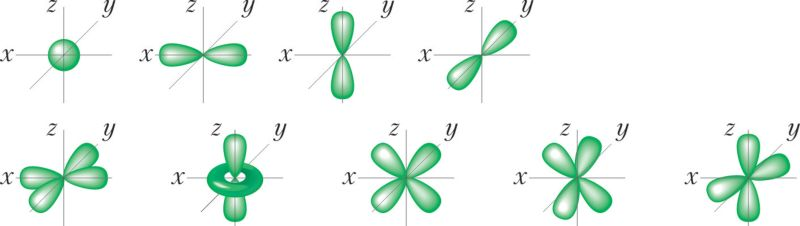

- На каждой орбитали — **не более двух электронов** (может быть 0, 1 или 2).
- Номер уровня = число подуровней: 1-й уровень → только 1s; 2-й → 2s и 2p; 3-й → 3s, 3p и 3d.

## 18. Порядок заполнения: принцип минимума энергии, Паули и Хунда [tt:2:27:21]

**1) Принцип минимума энергии.** Электроны заполняют орбитали в порядке **возрастания энергии**.

Порядок подуровней (запомнить один раз — и навсегда):

> **1s → 2s → 2p → 3s → 3p → 4s → 3d → 4p → 5s → …**

💡 Лайфхак для запоминания: пишите «S под S, P под P, D под D» по диагоналям — и схема сама выстроится. ⚡ Обратите внимание: после 3p заполняется **4s, а не 3d**! (В школьных задачах набор обычно заканчивается на 4p–5s.)

**2) Правило Хунда («правило пустого автобуса»).** Внутри одного подуровня электроны сначала занимают пустые орбитали **по одному**, и только потом спариваются. Как в автобусе: сначала все садятся на свободные места, и лишь затем — подсаживаются к кому-то.

**3) Принцип Паули.** На одной орбитали два электрона имеют **противоположные спины** (в школьной модели спин — это «стрелочка»: ↑ или ↓, условно +½ и −½; рисуем ↑↓).

**Что получается на практике:**

- 2p⁴: ↑↓ над первой ячейкой, по ↑ в двух других;
- 3d⁶: пять ячеек — сначала пять ↑ (по правилу Хунда), затем один ↓ на первую (5 + 1 = 6).

💡 Для химической связи нам особенно важны **неспаренные электроны** (одиночные ↑) — именно они участвуют в образовании связи по обменному механизму. Спаренные электроны (неподелённая электронная пара) тоже могут участвовать в связи, но реже.

## 19. Образование ионов. Изоэлектронные частицы [tt:2:37:37]

Самые **устойчивые (выгодные) электронные конфигурации** — у благородных газов (8-я группа главной подгруппы):

- гелий — 1s²; неон — 2s²2p⁶; аргон — 3s²3p⁶.

Атомы «стремятся» к конфигурации благородного газа тремя способами:

1. **отдать электроны**;
2. **принять электроны**;
3. образовать **химическую связь** (разберём позже — это тоже способ достичь устойчивого состояния).

Продолжение — на примерах (углерод, ионы, изоэлектронные частицы) и в заданиях ЕГЭ.

---

## 20. Изоэлектронные частицы: ионы из конфигурации благородного газа [tt:2:37:37]

**Пример с углеродом** (1s²2s²2p²): чтобы достичь устойчивого состояния, может

- **отдать** 4 электрона (2s⁰2p⁰) → катион C⁴⁺, или
- **принять** 4 недостающих электрона → 2s²2p⁶ → анион C⁴⁻.

Оба варианта делают частицу стабильнее. Тот же приём работает вокруг любого благородного газа: берём элементы «4 назад и 4 вперёд» — и видим, какие ионы образуются.

**Вокруг неона (10 e⁻)**:

- слева (принимают электроны): F⁻, O²⁻, N³⁻, C⁴⁻;
- справа (отдают электроны): Na⁺, Mg²⁺, Al³⁺, Si⁴⁺.

💡 Запоминалка про знаки ионов: **«Катя хорошая, Аня плохая»** — **кат**ион заряжен положительно, **ан**ион — отрицательно.

**Изоэлектронные частицы** — частицы с одинаковой электронной конфигурацией (например, все перечисленные выше — как у неона; ионы вокруг аргона — как у аргона).

📝 **Задание ЕГЭ.** Нужно выбрать **анионы** (не любые ионы!) со стабильной конфигурацией **3s²3p⁶** (это аргон, 18 e⁻). Элементы, ближайшие к аргону «слева»: Si, P, S, Cl → их анионы Si⁴⁻, P³⁻, S²⁻, Cl⁻ изоэлектронны аргону. ✅

> ⚠️ Слово «стабильные» важно: сера не может «принять 100 электронов» и стать аргоном — реально работают только ближайшие 4 элемента влево/вправо.

**Откуда берётся заряд** (пример серы): 16 протонов, 16 электронов → сера принимает 2 электрона → электронов стало 18, протонов по-прежнему 16. Заряд «2−» как раз показывает, что электронов **на два больше**, чем протонов. Так атом превращается в заряженную частицу — **анион**.

## 21. Основное и возбуждённое состояние атома [tt:2:49:03]

- **Основное состояние** — «штатное»: электроны заполняют орбитали по правилам (минимум энергии, Паули, Хунда).
- **Возбуждённое состояние** — при сообщении энергии извне (свет, излучение, нагрев) электрон **переходит на более высокий уровень**; строгий порядок заполнения нарушается.
- Распаривается обычно **неподелённая пара внешнего уровня** (самая уязвимая; 1s не распаривается — она близко к ядру).
- ⚡ **Главный результат:** в возбуждённом состоянии **увеличивается число неспаренных электронов** (у углерода 2 → 4) — значит, атом сможет образовать больше связей по обменному механизму.
- 💡 Это **теоретическая модель**: не значит, что углерод в органике «всегда возбуждён» — в реальности идёт постоянный переход между состояниями; модель просто удобна для описания связей.

## 22. Задание ЕГЭ: возбуждённая конфигурация ns¹np³nd² [tt:2:51:46]

📝 **Условие.** Определите, атомы каких элементов в **возбуждённом** состоянии имеют конфигурацию внешнего слоя **ns¹np³nd²**.

💡 **Приём: верните электроны в основное состояние.** «Убежавшие» электроны возвращаем: ns¹ → ns², а электрон с nd → в np. Получаем основную конфигурацию **ns²np⁴** (общее число электронов не меняется: 1 + 3 + 2 = 6 и 2 + 4 = 6).

- ns²np⁴ — элементы **6-й группы** главной подгруппы: O, S, Se, Te.
- **Ответ: сера и селен.**

> ⚠️ **Ловушка ЕГЭ:** кислород брать нельзя! У кислорода (2-й период) **возбуждённого состояния нет**: во-первых, некуда «распаривать» электроны, во-вторых, **у элементов 2-го периода физически нет d-орбиталей** (3d появляется только с 3-го периода).
>
> ⚡ Запомните элементы **без возбуждённого состояния**: **азот, кислород, фтор**. В заданиях про возбуждённое состояние это классическая ловушка.

## 23. Валентность: основные понятия [tt:2:59:42]

> Тема «спорная»: в науке и в ЕГЭ к валентности относятся неодинаково.

- Исторически валентность придумали **органики** — для описания органических веществ, где преобладают ковалентные связи (C–H, C–N, C–C).
- Когда была открыта **ионная связь**, понятие «валентность» для неё перестало быть корректным, но в школьном курсе осталось как «пережиток прошлого».
- **В ЕГЭ валентность = число связей, вне зависимости от характера их образования** (ионная или ковалентная). Но есть важная нестыковка:

> ⚠️ **Ключевое правило для экзамена.** В ионных соединениях (например, Na₂O) **нельзя рисовать валентные штрихи** между ионами — связь показываем только через **заряды**. Если поставить штрих между Na и O, балл снимут. При этом формально «валентность неважно какая» — вот такая ловушка школьной программы.

**Историческая справка:**

- **Закон постоянства состава Пруста**: качественный и количественный состав вещества не зависит от способа получения. (Сейчас известно, что бывают и вещества переменного состава, но для большинства закон работает.)
- **Эталон валентности — водород**: сколько атомов водорода элемент максимально присоединяет, такова его валентность. В NH₃ у азота валентность III, в CH₄ у углерода IV.

**Два алгоритма для бинарных соединений** (в них всё «круто» работает):

1. **составление формулы по известным валентностям**;
2. **определение валентности по известной формуле**.

💡 Порядок записи в формуле: **более электроотрицательный элемент пишем в конце** (поэтому «PCl₃», а не «Cl₃P»).

---

## 24. Составление формул и определение валентности [tt:3:06:47]

### Алгоритм 1: формула по известным валентностям

1. Записываем символы: **более электроотрицательный элемент — в конце** (исключения-«традиции»: NH₃, PH₃, CH₄ — так исторически сложилось).
2. Находим **наименьшее общее кратное** валентностей.
3. Делим НОК на каждую валентность — получаем индексы.

💡 На практике удобнее «**крест-накрест**»: валентность одного элемента переносим по диагонали к другому. Пример: P(III) и Cl(I) → PCl₃. Пример: S(IV) и O(II) → «S₂O₄» → **сокращаем на 2** → SO₂.

- Валентность обозначается **римскими цифрами** и принимает значения **от I до VII**.
- ⚡ **Валентности «0» не бывает** (в отличие от степени окисления): валентность 0 означала бы, что атом вообще ни с чем не связан — тогда говорить о валентности бессмысленно.

### Алгоритм 2: валентность по известной формуле

Для бинарного соединения AₐB_b работает правило:

> **валентность(A) · индекс(A) = валентность(B) · индекс(B)**

⚠️ Но это работает **только для бинарных соединений**! Для H₂SO₄, HNO₃ и других небинарных веществ валентность «летит» — именно поэтому ввели **степень окисления**, которая работает со всеми веществами независимо от природы связи.

## 25. Химическая связь. Ковалентная неполярная и полярная связь [tt:3:14:26]

**Химическая связь** — совокупность сил, удерживающих частицы в молекуле. Связь — это «компромисс» (симбиоз, как гриб и водоросль в лишайнике): оба атома одновременно достигают устойчивой конфигурации благородного газа.

- **Межмолекулярные взаимодействия** — между частицами: именно **водородные связи** делают воду жидкой при н. у. (без них вода была бы газом!) и обеспечивают работу белков. Современная химия открывает всё новые межмолекулярные взаимодействия.
- **Внутримолекулярные связи** — самые прочные, с них начинаем.

**Ковалентная неполярная связь (H₂).** У водорода 1s¹, он хочет 1s² (как гелий). Два атома водорода делают свои электроны **общими** (аналогия спикера — «полароид, купленный с другом»: то у тебя, то у друга). Общая электронная пара одинаково принадлежит обоим атомам и никуда не смещается — атомы одинаковые. Степени окисления обоих атомов — 0. Это **обобществление электронной пары**. Каждый водород «получил» 2 электрона — конфигурация гелия достигнута.

**Ковалентная полярная связь (HCl).** H (1s¹) хочет 1s², Cl (3s²3p⁵) хочет 3s²3p⁶ (как аргон). У каждого есть по **одному неспаренному электрону** — образуют общую пару. Но хлор **электроотрицательнее**, поэтому общая пара **смещается в сторону хлора**. Так (по «графику») каждый достиг своей цели: H — двух электронов, Cl — восьми.

**Обменный (равноценный) механизм** — каждый атом предоставляет в общее пользование **по одному** своему электрону.

## 26. Донорно-акцепторный механизм [tt:3:24:38]

Идея: один атом (донор) отдаёт в общее пользование **свою неподелённую пару**, другой (акцептор) принимает её — и оба достигают устойчивой оболочки.

**Пример — угарный газ CO.** C: 2s²2p², O: 2s²2p⁴.

1. Если бы связь была двойной (по 2 неспаренных электрона от каждого), то кислород получил бы **октет** (8 e⁻), а углерод — только **6 e⁻**.
2. Тогда кислород «делает добрый жест»: **одну из своих неподелённых пар** делает общей. Кислород **ничего не теряет** (у него как было 8 электронов, так и осталось), а углерод получает октет.
3. Итог: в CO — **тройная связь**. Донор — кислород, акцептор — углерод.

⚡ **Что нужно знать для ЕГЭ (основные случаи донорно-акцепторного механизма):**

1. **Соли аммония и соли фосфония** (последние появились в банке ФИПИ — берём на вооружение!), а также соли аминов;
2. **все соединения, где азот +5**: N₂O₅, HNO₃, нитраты — если видите N⁺⁵, механизм точно есть;
3. озон, угарный газ (реже);
4. **комплексы**.

**Октет и дублет:** атомы стремятся к 8-электронной (октет) или 2-электронной (дублет, у водорода/гелия) оболочке — это и есть «цель», к которой атомы образуют связи.

---

**Перерыв** [tt:3:31:39] — далее блок продолжается: ионная связь, металлическая связь, водородная связь.

---

## 27. Ионная связь [tt:3:46:55]

Логика: в неполярной ковалентной связи общая пара — на равном расстоянии от атомов, в полярной — смещена к более электроотрицательному, а в **ионной** связи электроны **целиком переходят** к одному атому.

**Пример NaF:**

- Na (3s¹) хочет стать как неон → **отдаёт 1 электрон**;
- F (2s²2p⁵) тоже хочет как неон → **принимает 1 электрон**;
- получаются заряженные частицы: Na⁺ и F⁻.

Общей электронной пары между ними нет, но они не разлетаются: **разноимённые заряды притягиваются** — удерживает **электростатическое притяжение** (физика!). Это и есть ионная связь.

- **Катион аммония NH₄⁺** «притворяется металлом»: в NH₄Cl формально нет металла, но связь между NH₄⁺ и Cl⁻ — ионная (соединения аммония во многом похожи на соединения щелочных металлов).
- **Простые и сложные ионы:** простой ион — из атомов одного элемента (Cl⁻, S²⁻, Na⁺); сложный — из нескольких (NO₃⁻, SO₄²⁻, PO₄³⁻, NH₄⁺, PH₄⁺).

> ⚡ **Ключевой вывод для заданий на химическую связь:** внутри **сложного иона всегда есть ковалентная (полярная) связь** (N–O, S–O, P–O…). Поэтому:
>
> - **NaCl** — только ионная связь (простой катион + простой анион);
> - **Na₂SO₄** — и ионная, и ковалентная полярная (внутри сульфат-иона).

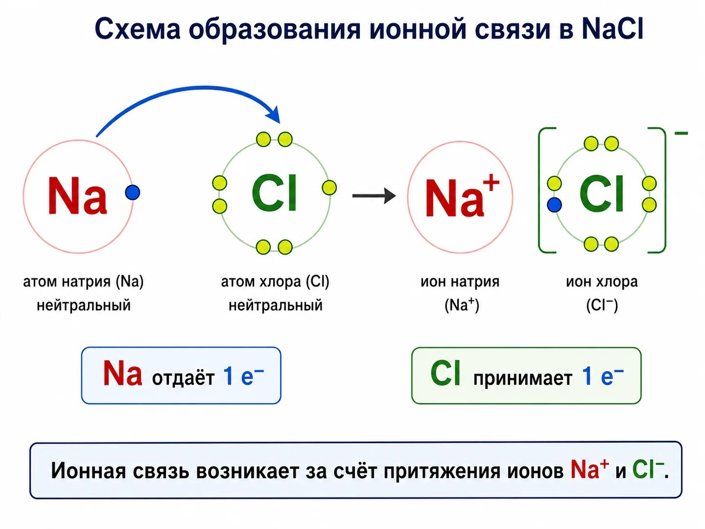

## 28. Металлическая связь [tt:3:54:09]

Металлическая связь возникает **в кристаллах металлов**. Внешне формула «Na» или «Cu» — один атом, но на микроуровне атомы в решётке связаны друг с другом.

- Металлы **склонны отдавать** электроны (принимать — нет): атом Na отдаёт e⁻ и превращается в Na⁺ с конфигурацией неона.
- Но электроны **никуда не улетают** — они остаются внутри решётки, между катионами, и время от времени притягиваются обратно: Na⁺ + e⁻ → Na⁰.
- Этот постоянный, непрерывный обмен (туда-сюда) называется **электронный газ** — хаотичное движение электронов, похожее на газ.

**Свойства металлов, которые из этого следуют:** электропроводность (ток — движение заряженных частиц), теплопроводность, металлический блеск.

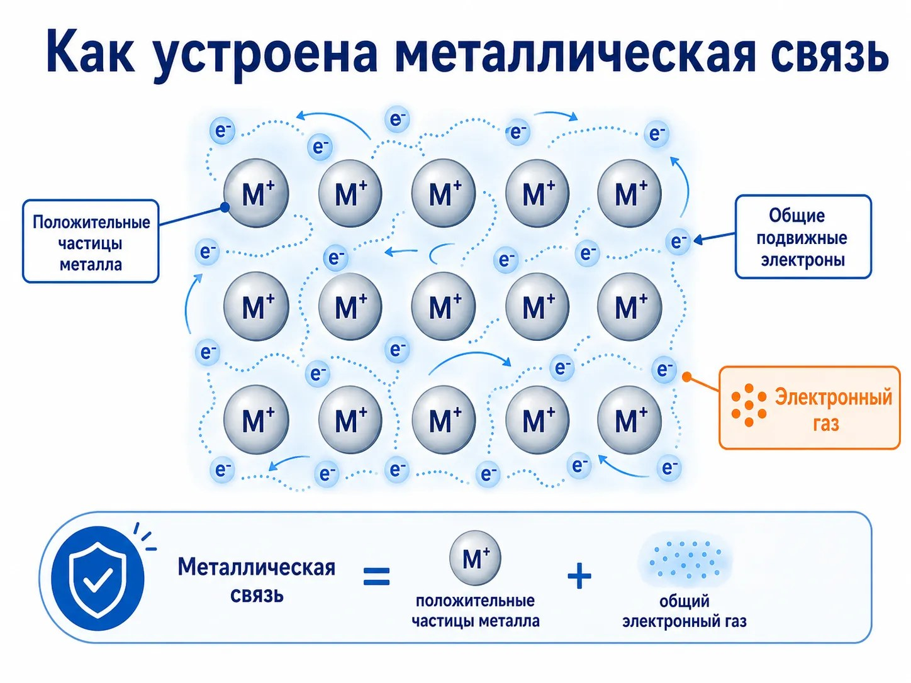

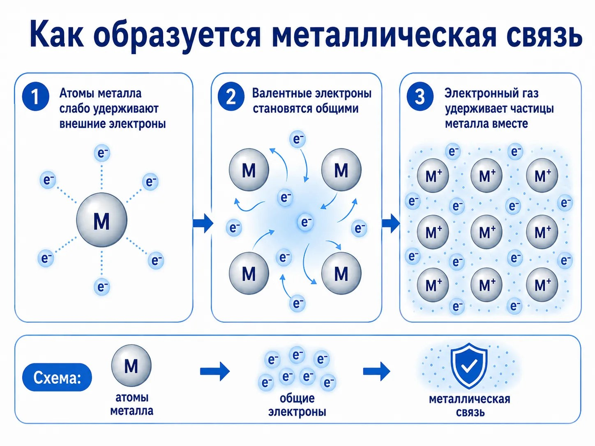

**Температуры плавления — очень разные:** вольфрам не расплавится «в ладошке» (нужно более 3000 °C), а есть металлы, которые плавятся при температуре тела. Удобно делить металлы на две группы:

- **d-металлы** (Cu, Fe, Co, Cr, Mn…) — «типичные» металлы, прочные и тугоплавкие;
- **активные металлы** (щелочные, щёлочноземельные) — мягкие (некоторые режутся кухонным ножом), легкоплавкие.

> ⚡ **Металлы в ЕГЭ:** у металлов бывают **только положительные** степени окисления (отрицательных нет), они не образуют собственных анионов. Но металлы могут входить в состав **кислородсодержащих анионов**: алюминат, хромат, перманганат и др.

## 29. Водородная связь [tt:4:00:29]

📝 **«Найди ошибку»:** «В молекуле аммиака образуется водородная связь». Ошибка: правильно — **МЕЖДУ молекулами аммиака**. Для водородной связи нужны **минимум две молекулы**. (В реальности существуют и внутримолекулярные водородные связи — например, в салициловой кислоте, — но в ЕГЭ водородную связь считают межмолекулярной.)

**Механизм.** В молекуле NH₃ связь N–H сильно полярная: азот сильно стягивает электроны на себя → на азоте δ⁻, на водородах δ⁺ (это **частичные** заряды, не степени окисления!). Молекулы притягиваются друг к другу противоположными полюсами. По сути водородная связь основана на **электростатическом взаимодействии** (похожа на ионную).

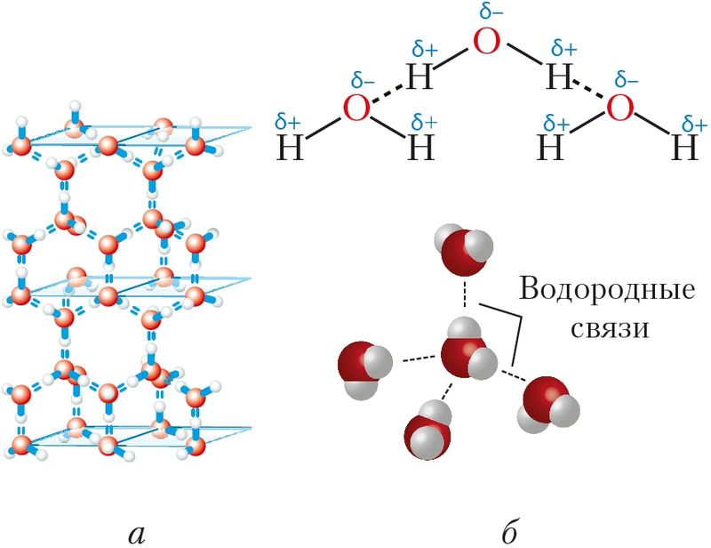

- «Топ электроотрицательности»: **F > O > N** — с ними водород и образует водородные связи.
- Водородные связи **слабые**: постоянно рвутся и образуются заново (динамика), но их **очень много** — и они «берут количеством». Одна молекула воды может образовать **до 4 водородных связей** (2 за счёт кислорода, 2 за счёт атомов водорода).
- **Следствие:** повышаются температуры кипения и плавления — чтобы вскипятить жидкость, нужно разорвать не только межмолекулярные взаимодействия, но и водородные связи (это требует дополнительной энергии).

⚡ **Где искать водородную связь (важно для ЕГЭ):**

- нужен атом **водорода, напрямую связанный** с F, O или N (связь O–H, N–H);
- органические вещества: **спирты, карбоновые кислоты, первичные и вторичные амины**;
- **третичные амины не подходят** — у них нет связи N–H (например, у (CH₃)₃N «голый» азот);
- ⚠️ **альдегиды и кетоны (например, ацетальдегид CH₃COH) водородных связей между молекулами не образуют!** Просто «есть кислород и водород» недостаточно — нужна именно группа O–H. А вот у уксусной кислоты (CH₃COOH) такая группа есть — и водородные связи появляются.

**Значение для жизни:** водородные связи определяют пространственную структуру белков (сворачивание, «карман» для связывания), лежат в основе **молекулярного докинга** при разработке лекарств и целой области — **супрамолекулярной химии** (за неё недавно дали Нобелевскую премию).

---

## 30. Практика: определение типов химической связи [tt:4:11:49]

📝 **ОГЭ: найти вещества с ионной связью.** Приём: «металл + что-то ещё». Например, KBr, K₂O — ионная связь есть. ⚠️ «Просто медь» не подойдёт — для ионной связи нужны металл и неметалл в составе вещества. И отдельно: **PCl₃ — это не соль**, а бинарное соединение (нет катиона металла/аммония) — не путать с солями.

📝 **ОГЭ: найти вещества с ковалентной неполярной связью.** Простые вещества: H₂, Cl₂, O₂, N₂, а также аммиак/вода/сероводород — там связь **ковалентная полярная** (разные элементы).

> ⚡ **Любимая ловушка реального ЕГЭ: ковалентная неполярная связь бывает и в СЛОЖНЫХ веществах!**
>
> 1. **Почти вся органика** — если в соединении ≥ 2 атомов углерода, есть связь **C–C** (не важно, одинарная, двойная или тройная) → ковалентная неполярная.
> 2. **Пероксиды и «перекись»** — всегда есть мостик **O–O**: H₂O₂, Na₂O₂, BaO₂ и др.
> 3. **Пирит FeS₂** — дисульфидный мостик **S–S**.
> 4. **Карбид кальция CaC₂, карбид алюминия Al₄C₃** — мостик между атомами углерода (C–C). Карбиды металлов — неорганика.
>
> И не смущайтесь, если вещество записано без индекса (алмаз, графит, кремний Si, сера S): в кристалле атомы всё равно связаны друг с другом → ковалентная неполярная связь есть.

## 31. Высшая и низшая валентность: особенности заданий ЕГЭ [tt:4:18:31]

> 💡 Главное правило-упрощение: **у металлов валентность и степень окисления всегда совпадают** (Fe⁺² → валентность II, Fe⁺³ → III). Исключений нет. Все проблемы — с неметаллами.

- **Высшая валентность = номер группы.**
- **Низшая валентность = число неспаренных электронов на внешнем уровне в основном состоянии.**
- Есть также промежуточные валентности.

⚠️ **Исключения, где высшая валентность ≠ номер группы** (обязательно запомнить для ЕГЭ):

| Элемент | Группа | Реальная высшая валентность |
|---|---|---|
| F | VII | всегда только **I** (высшая и постоянная) |
| N | V | не выше **IV** |
| O | VI | **II или III** (не VI) |
| Fe | VIII (побочная) | не VIII |
| Cu | I | высшая **II** |

**Элементы с постоянной валентностью** (встречаются реже, чем «переменные»):

- **I**: водород, щелочные металлы, серебро;
- **II**: щёлочноземельные металлы, а также Be, Mg, **Zn**;
- **III**: алюминий (бор для ЕГЭ не рассматриваем).

💡 **Негласное правило для переменных валентностей:** элемент в **чётной** группе проявляет **чётные** валентности, в **нечётной** — **нечётные**. Примеры: сера (VI группа) → II, IV, VI; фосфор (V группа) → III, V (плюс IV в PH₄⁺ по донорно-акцепторному механизму); галогены (VII) → I, III, V, VII; кремний, германий, олово (IV) → II, IV; углерод → II, IV (и III в угарном газе CO — но это редкий случай).

## 32. Валентность в небинарных соединениях: кислоты фосфора [tt:4:39:37]

Небольшой технический перерыв из-за лагов трансляции [tt:4:32:27] — после него разбирается «крутая» тема.

📝 **Задача:** определить валентность фосфора в H₃PO₂, H₃PO₃, H₃PO₄.

- Если рассуждать через степень окисления (P⁺¹, P⁺³, P⁺⁵), валентности получились бы I, III, V.
- **Но в реальности фосфор во всех трёх кислотах пятивалентен!** Самые устойчивые формы фосфора — именно пятивалентные.
- **Вывод:** в сложных небинарных соединениях валентность и степень окисления **не всегда совпадают**, поэтому нужно уметь рисовать **структурные формулы** (в них все валентности видны «вживую»).

**Основность кислоты** = число **кислых (подвижных) атомов водорода** — тех, что способны замещаться на металл.

- H₃PO₂ — **одноосновная** (только 1 подвижный H);
- H₃PO₃ — **двухосновная** (2 подвижных H);
- H₃PO₄ (ортофосфорная) — **трёхосновная** (все 3 H подвижные).

💡 Водороды, **напрямую связанные с фосфором** (P–H), — «**химически мёртвые**»: связь слабополярная, не разрывается, на металл не замещается. Поэтому, например, в H₃PO₂ из трёх водородов кислый только один.

⚠️ Не путайте **ортофосфорную** H₃PO₄ и **метафосфорную** HPO₃ — это разные кислоты.

---

## 33. Степень окисления и правила её определения [tt:4:47:07]

**Проблема.** В классическом понимании степень окисления — «количество отданных/принятых электронов» (в KClO₃: Cl⁺⁵ «отдал» 5 e⁻, K⁺ — 1 e⁻, O⁻² — «принял» 2 e⁻). Но реально отдача/принятие электронов происходит **только в ионной связи**! Между хлором и кислородом в KClO₃ связь ковалентная — никто ничего полностью не забирает (реальные заряды в HCl, например, ±0,18, а не ±1).

💡 **«Гениальный выход» химиков:** договориться считать, будто **все связи — ионные**.

> ⚡ **Определение для ЕГЭ: степень окисления — условный (нереальный, искусственный) целочисленный заряд атома, если допустить, что все связи в соединении образованы по ионному механизму.**

- Это инструмент: удобно считать, составлять формулы, писать реакции, названия. В ОВР без него никуда.
- Дробные степени окисления существуют, но практически только у **кислорода**: −½ в **супероксидах** (например, KO₂). Азаниды (−⅓) на ЕГЭ не рассматриваются.

### Правила (перекликаются с валентностями)

- **Высшая степень окисления = номер группы** — и для металлов, и для неметаллов.
  - ⚠️ Исключения (обязательно знать!): **O** — высшая **+2**; **F** — высшей нет вообще, только 0 и −1 (самый электроотрицательный элемент); **Fe** — высшая **+6**; **Cu** — высшая **+2**.
- **Низшая степень окисления:**
  - у металлов — **0** (отрицательных СО у металлов в ЕГЭ нет!);
  - у неметаллов — **номер группы − 8**: P: 5 − 8 = −3; S: 6 − 8 = −2.
- Прежде чем заучивать промежуточные степени окисления, **выучите диапазон**: от низшей до высшей.
- 💡 **Правило чётности:** элемент в чётной группе проявляет чётные степени окисления, в нечётной — нечётные. Отлично работает для 3-го и 4-го периодов (P, S, галогены). ⚠️ Для 2-го периода — плохо: у N, O, C встречаются и «чётные», и «нечётные» значения (углерод вообще «плюёт» на правило).

**Дополнительно:**

- **FeS₂ (пирит)** — у серы степень окисления **−1** (и это вещество с ковалентной неполярной связью S–S). Запомнить!
- S₈, P₄ — «любовь» серы и фосфора к цепочкам и циклам (у углерода — тысячи атомов в цепочках, у S/P — меньше).

💡 **Как определить СО в ионе (лайфхак):** превратите ион в нейтральную молекулу, добавив H⁺ (универсальный катион). Пример CrO₄²⁻ + 2H⁺ → H₂CrO₄: 2·(+1) + 4·(−2) = −6 → не хватает 6 плюсов → **Cr⁺⁶**.

## 34. Практика: валентность и степени окисления [tt:5:09:59]

📝 **Задание 1. Элементы, проявляющие валентность I.** Na (I — единственная, постоянная) и Cl (I, III, V, VII). Кремний (IV группа) — только чётные, марганец и хром — от II и выше. Ответ: **Na, Cl**.

📝 **Задание 2. Элементы, у которых валентность ≠ номер группы.** Классические «исключения» — F, O, N (они же «виноваты» в водородной связи, донорно-акцепторном механизме и т. д.). Для азота высшая валентность IV (не V), у кислорода — III (по ЕГЭ).

📝 **Задание 3. Элементы с постоянной степенью окисления.** Al (+3 всегда), Mg (+2 всегда). ⚠️ Кремний — нет (бывает −4 и +4, например Mg₂Si и SiO₂), углерод и азот — «рекордсмены» по переменчивости.

📝 **Задание 4. Разность между высшей и низшей степенью окисления.** Считаем для K, Be, N, C, O:

| Элемент | Высшая | Низшая | Разность |
|---|---|---|---|
| K | +1 | 0 | 1 |
| Be | +2 | 0 | 2 |
| N | +5 | −3 | **8** |
| C | +4 | −4 | **8** |
| O | +2 | −2 | 4 |

Работаем аккуратно со знаками: 5 − (−3) = 8, 4 − (−4) = 8. **Ответ: азот и углерод.**

💡 Ещё один тип заданий — **общие формулы ионов** (например, «ЭO₄²⁻»); тоже решается через степени окисления (разберём в следующих стримах при запросе).

## 35. Кристаллические решётки [tt:5:16:02]

Решётки удобно сопоставлять с типами химической связи.

**Металлическая решётка** — там, где металлическая связь (всегда «в комплекте» с металлами):

- металлы **непрозрачны**, имеют блеск;
- **ковкие и пластичные** — при нагреве превращаются в «пластилиноподобную» массу, из металла можно выковать любое изделие (в древности так ковали мечи);
- все металлы **твёрдые, кроме ртути** — единственного жидкого металла;
- электропроводность и теплопроводность (за счёт электронного газа).

**Ионная решётка** (соли, оксиды металлов, основания):

- вещества **твёрдые, но хрупкие** (не пластичные!);
- ⚡ **в твёрдом виде соли ток НЕ проводят**: заряженные частицы есть, но они «стоят» в фиксированных положениях и не движутся;
- но стоит расплавить или растворить соль в воде — ионы начинают двигаться, и появляется проводимость. В растворе соли — ток проводят.

### Продолжение: атомная, молекулярная решётки и аморфные вещества

**Атомная решётка** (кремний, алмаз, графит, кремнезём SiO₂, кварц, песок, карборунд SiC):

- **очень твёрдые, очень тугоплавкие, очень инертные**;
- связи ковалентные (часто неполярные) — очень прочные;
- **нерастворимы в воде, нелетучие** (твёрдые вещества не пахнут);
- 💡 Представляйте **песок**: твёрдый, тугоплавкий, не растворяется в воде (иначе пляжей бы не было), не пахнет.

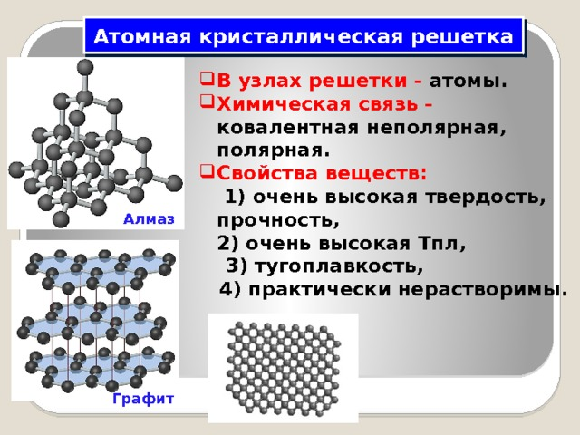

**Молекулярная решётка** — у газов, жидкостей и «мягких» твёрдых веществ (лёд, сухой лёд CO₂, органические вещества):

- слабые межмолекулярные взаимодействия → **низкие температуры плавления и кипения**, летучесть;
- **летучесть** — способность молекул «разлетаться» (пример: открытая уксусная кислота — запах чувствуется через секунды по всей квартире).

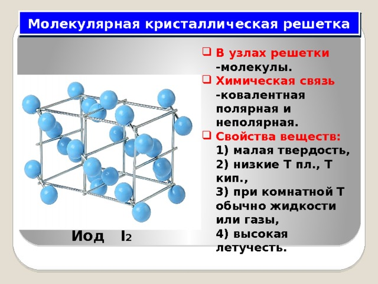

> ⚠️ Решётки рассматривают **только для твёрдых веществ**: в растворах и расплавах упорядоченной структуры нет. Говоря «у CO₂ молекулярная решётка», имеем в виду твёрдый CO₂ (сухой лёд).

**Аморфные вещества** (шоколад, пластилин, воск, янтарь, канифоль):

- **нет чёткой температуры плавления** — вещество размягчается в некотором диапазоне (как шоколадка на солнце: сначала «недотвёрдое и недожидкое»);
- строение неупорядоченное, «максимальный хаос».

💡 **Лайфхак:** простое вещество **с индексом** (P₄, S₈, O₃, C₆₀) — всегда **молекулярная** решётка, ничего считать не нужно!

**Алгоритм определения решётки (метод двух вопросов):**

1. Есть ли в составе **металл или катион аммония**? → ветка «металлическая/ионная»: металл как простое вещество → металлическая решётка; металл + неметалл (соль, оксид, гидроксид) → ионная.
2. Если металла нет — неметаллы: простое вещество из «списка атомных» (Si, алмаз, графит, SiO₂/кварц/песок, SiC) → атомная; всё остальное (газы, жидкости, органика, CO₂) → молекулярная.

📝 **ОГЭ-практика. «Свойства твёрдых веществ ионного строения»:**

- ✅ **хорошая растворимость в воде** (для многих солей);
- ✅ **высокая температура плавления**;
- ❌ высокая электропроводность — ловушка: **твёрдая соль ток не проводит** (ионы неподвижны);
- ❌ пластичность/ковкость — ионные вещества **хрупкие** (комочек слипшейся соли рассыпается при падении, в отличие от металла).

📝 **«Два вещества молекулярного строения»:** S₈ — молекулярная (простое с индексом), CO₂ — молекулярная; NaCl, K₂O — ионные, SiO₂ — атомная.

---

## 36. Количество вещества, моль и молярная масса [tt:5:31:23]

**Проблема:** атомы и молекулы не пересчитать поштучно (на кончике иглы — миллиарды). **Решение химиков** — особая величина, связывающая **массу** (то, что легко измерить на весах) с **числом частиц**.

- **Моль** — порция вещества, содержащая определённое число частиц. **Количество вещества** обозначается **n** (ню), измеряется в **молях**.
- **Число Авогадро** N_A = **6,02·10²³ моль⁻¹** (в задачах допустимо округлять до 6·10²³). Именно столько частиц содержится в 1 моле — любых частиц: молекул, атомов, ионов, электронов, протонов…
- 💡 **Аналогия с мешками:** в двух мешках по 100 фруктов — «количество» одинаковое, а массы разные (100 слив ≠ 100 мандаринов). Моль — это «мешок» с одинаковым числом частиц, но вещества в нём разные и весят по-разному.

**Ключевые формулы:**

| Формула | Что находит | Когда применима |
|---|---|---|
| **n = m / M** | количество вещества через массу | для любых веществ (твёрдых, жидких, газов) |
| **N = n · N_A** | реальное число частиц | для любых частиц |
| **n = V / V_m** | количество вещества через объём | только для газов (при н. у.) |

**Молярная масса M** численно равна относительной молекулярной массе Mᵣ, но имеет **размерность г/моль**: M(H₂S) = 34 г/моль; 34 г H₂S — это 1 моль.

### Задачи (разбор со стрима) [tt:5:41:27]

📝 **1. Какое количество вещества составляет 5,6 г KOH?**
n = m / M = 5,6 / (39 + 16 + 1) = 5,6 / 56 = **0,1 моль**.

💡 Тонны/миллиграммы переводите в **граммы** — пусть числа большие, зато не ошибётесь.

📝 **2. 9,6 т серы → ? моль.** 9,6 т = 9 600 кг = 9 600 000 г = 9,6·10⁶ г; n = 9 600 000 / 32 = **300 000 моль** (можно записать 300 кмоль).

📝 **3. 5,85 мг NaCl → ? моль.** 5,85 мг = 0,00585 г (милли — делим на 1000!); n = 0,00585 / 58,5 = **0,0001... → 0,1 моль** (перевод: 5,85 мг = 0,00585 г; n = 0,00585/58,5 ≈ 10⁻⁴? — на стриме ответ 0,1 моль получился при 5,85 г; следите за переводом миллиграммов!).

📝 **Атомистика: сколько атомов H и S в 3 моль H₂S?**
«Моли — это штуки»: в одной «штуке» H₂S два водорода → в 3 — шесть: **6 моль H** и **3 моль S**. Правило: **умножаем количество вещества на индекс**.
> ⚡ Не пугайтесь, что водорода «больше», чем самого вещества: мы считаем **штуки** (моли), а не граммы! 6 моль H > 3 моль H₂S — это нормально.

📝 **4. Дано 1,806·10²⁴ молекул озона.** Это N (большое число — значит, работаем через число Авогадро): n = 1,806·10²⁴ / 6,02·10²³ = **0,3 моль**. Сколько молей **атомов** кислорода? 0,3 · 3 = **0,9 моль**.

📌 Единица измерения числа Авогадро — **моль⁻¹**: N_A = N / n, [N_A] = 1/моль.

## 37. Закон Авогадро и молярный объём газа [tt:5:52:20]

**Закон Авогадро:** в **равных объёмах** разных газов при **одинаковых условиях** содержится **одинаковое число молекул** (1 л CO₂, 1 л H₂, 1 л метана — везде одинаковое число молекул).

**Молярный объём V_m = 22,4 л/моль** (при н. у.) — объём одного моля **любого газа**. Следствие: n = V / 22,4.

**Откуда взялось 22,4?** Из уравнения Клапейрона–Менделеева: подставляем T = 273 К (0 °C — обязательно в кельвинах!), давление 101,325 кПа и n = 1 моль — получаем V = 22,4 л.

- При **стандартных условиях** (25 °C) молярный объём будет другим — около **24,5 л/моль**.
- ⚡ V_m — «плавающая» величина: меняется с температурой и давлением. На ЕГЭ для удобства используют 22,4 л/моль.

## 38. Относительная плотность газов и способы собирания газов [tt:5:58:52]

**Следствие закона Авогадро:** отношение масс одинаковых объёмов двух газов равно отношению их молярных масс:

> **D = M(газа) / M(газа сравнения)** — относительная плотность (величина **безразмерная**: г/моль делится на г/моль).

- Внизу — газ, **по которому** считаем плотность («плотность по водороду», «по воздуху» и т. д.).
- 💡 Применение: понять, **легче или тяжелее воздуха** газ, который мы получаем, — от этого зависит способ собирания. И в задании 33, где сравнивают газы.

**Молярная масса воздуха = 29 г/моль** (близка к M(N₂) = 28, потому что азот — основной компонент воздуха).

- Если M(газа) **< 29** → газ **легче воздуха**, улетает вверх → собираем пробиркой **дном вверх**. Пример: гелий He, M = 4 г/моль (благородные газы одноатомны — никакой «He₂»!), он в ~7 раз легче воздуха.
- Если M(газа) **> 29** → газ **тяжелее воздуха** (например, NO₂) → собираем в пробирку **вниз**, газ скапливается снизу.

💡 Пример: M(CO₂) = 44 > 29, значит углекислый газ тяжелее воздуха — «сухой лёд» и CO₂ стелются внизу.

---

## 39. Классификация неорганических веществ [tt:6:48:04]

**Большой перерыв** [tt:6:07:48] — после него начинается блок классификации.

Вещества делятся на **чистые** (которых в природе почти нет) и **смеси**. Чистые — на **простые** и **сложные**.

**Простые вещества:**

- **металлы** и **неметаллы**; «диагональ» в периодической системе: в правом верхнем углу — преимущественно неметаллы;
- есть полуметаллы (сурьма, германий) — комбинируют свойства металлов и неметаллов, но в школьной химии это не нужно;
- 💡 **любой элемент d-блока — металл** (даже титан, хром, марганец);
- благородные газы часто выделяют отдельной группой, но можно рассматривать их в контексте неметаллов.

**Сложные вещества** — на стриме разбирается «неклассический» подход: вместо привычных кислот/оснований/солей/оксидов — **бинарные** (из двух элементов) и **небинарные** (из трёх и более).

**Бинарные соединения:**

| Группа | Что это | Примеры/нюансы |
|---|---|---|
| Водородные соединения | **гидриды** (H⁻, солеподобные) и **летучие водородные** (H⁺¹ c неметаллами) | NaH, CaH₂ и SiH₄, HCl, H₂S |
| Галогениды | фториды, хлориды… | NaCl (соль), PCl₃ (не соль!) |
| Силициды, карбиды, фосфиды, нитриды, сульфиды | соединения с неметаллами | Si⁻⁴, «‑ид» — обычно подсказка на низшую СО |
| Кислородные соединения | не только оксиды: пероксиды, надпероксиды, озониды | Na₂O, Na₂O₂, KO₂ |

- **Нитриды и фосфиды** — преимущественно с **активными** металлами (азот малореакционноспособен): щелочные, щёлочноземельные, Mg, Al.
- **Силициды** — кремний −4, проблем нет.
- **Карбиды** — бывают **метаниды** (Al₄C₃: при гидролизе — метан), **ацетилениды** (CaC₂: при гидролизе — ацетилен), пропиниды (не для ЕГЭ). Углерод в карбидах имеет разную СО: −4 (Al₄C₃), −1 (CaC₂). ⚡ **На ЕГЭ дадут только два карбида — Al₄C₃ и CaC₂.**
- **Сульфиды:** FeS (S⁻²) и **FeS₂ (пирит, S⁻¹**, дисульфид, связь S–S — ковалентная неполярная).

💡 Суффикс **«‑ид»** — подсказка: обычно это **низшая** степень окисления элемента (но не всегда, как с карбидами).

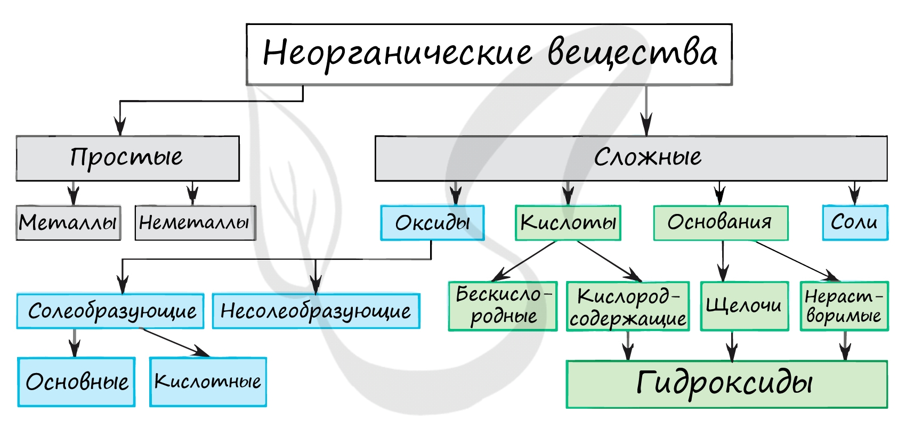

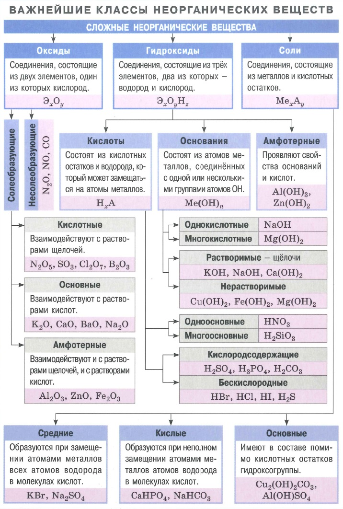

## 40. Водородные соединения и галогениды [tt:6:56:21]

**Гидриды** (щелочные и щёлочноземельные металлы; AlH₃ в ЕГЭ не дают):

- ⚡ **Гидролиз гидридов — это ОВР!** В воде/растворе кислоты идёт **сопропорционирование**: H⁻¹ и H⁺¹ встречаются, давая H₂ (степень окисления 0 — промежуточная между −1 и +1). Это один из немногих примеров, когда обычный гидролиз оказывается окислительно-восстановительным процессом.

**Летучие водородные соединения:** их кислотно-основные свойства меняются по периодическому закону (разбор дальше).

- ⚡ **Силан SiH₄: у водорода +1, у кремния −4** — запомнить! Хотя электроотрицательности Si и H близки, в ЕГЭ считают именно так. Если посчитать наоборот (Si⁺⁴, H⁻¹), легко потерять балл: например, при окислении силана перманганатом в щелочной среде получается **силикат** (Si окисляется), а «вариант с выделением H₂» — ошибка.

**Галогениды:**

- ⚡ **Соль обязательно содержит катион металла или катион аммония.** Если ни того, ни другого нет — это НЕ соль, а солеподобное бинарное соединение (PCl₃, SiCl₄ и т. п.). Такие вещества могут гидролизоваться в щелочной среде (обычно с избытком щёлочи).
- **Интергалогениды** (межгалогенные соединения): галогены реагируют друг с другом все подряд; что конкретно образуется — знать не обязательно, важен сам факт: **любой галоген с любым галогеном реагирует**.

## 41. Соединения с кислородом. Классификация оксидов [tt:7:03:34]

**Кто такие оксиды, а кто — нет:**

- **Оксиды** — соединения, где кислород имеет степень окисления **−2**. Если у кислорода другая СО — это НЕ оксид:
  - **пероксиды** — O⁻¹ (H₂O₂, Na₂O₂);
  - **надпероксиды (супероксиды)** — O⁻½ (KO₂);
  - **озониды** — O⁻⅓ (KO₃);
  - **фториды кислорода** — кислород вообще в положительной СО (+1, +2) — тоже не оксиды.

Оксиды делятся на **солеобразующие** и **несолеобразующие**.

**Несолеобразующие** (мало с чем реагируют): **CO, NO, N₂O** (и SiO, но на реальном ЕГЭ его обычно нет). 💡 Правило: если не можете придумать соответствующую кислоту (с C⁺², N⁺¹, N⁺²) — оксид несолеобразующий. У азота кислот всего две: HNO₂ и HNO₃.

**Солеобразующие: кислотные, основные, амфотерные.** Названия кислотных оксидов имеют **три варианта** (пример P₂O₅):

1. «оксид фосфора(V)» — классическое;
2. «**фосфорный ангидрид**» — ангидрид = «лишённый воды» (получен дегидратацией кислоты);
3. «**пентаоксид** фосфора» — префикс показывает число атомов кислорода (пента = 5); валентность указывать уже не нужно.

⚠️ На реальном экзамене всё чаще дают названия-ангидриды (фосфорный, угольный, сернистый ангидрид) — не растеряйтесь!

**Алгоритм определения типа оксида:**

- если оксид из списка несолеобразующих → несолеобразующий;
- если в составе **неметалл** → либо несолеобразующий, либо **кислотный** (третьего не дано);
- если **металл** — смотрим степень окисления:
  - **+1, +2** → основный;
  - **+3, +4** → амфотерный;
  - **+5 и выше** → кислотный;
  - ⚠️ исключения (амфотерные при +2): **BeO, ZnO**, а также SnO, PbO — запомнить в первую очередь BeO и ZnO.

💡 С ростом степени окисления металла **кислотные свойства усиливаются** (пример хрома: CrO — основный, Cr₂O₃ — амфотерный, CrO₃ — кислотный).

## 42. Гидроксиды: основания, амфотерные гидроксиды и кислоты [tt:7:12:50]

⚡ **Классификация гидроксидов полностью повторяет классификацию оксидов:** основному оксиду соответствует основный гидроксид (основание), амфотерному — амфотерный, кислотному — **кислотный гидроксид, то есть кислородсодержащая кислота**.

> Кислоты H₂SO₄, HNO₃ — формально тоже **гидроксиды**: в их структуре есть группы –OH, связанные ковалентно.

💡 **Лайфхак:** если в задании написано непривычное «**гидроксид серы(VI)**» — просто отщепляйте воду, пока не получите кислоту:
H₆SO₆ → (−H₂O) → H₄SO₅ → (−H₂O) → **H₂SO₄**. (Ещё одну воду отщеплять нельзя — «скатитесь» в оксид.)

- У оснований и амфотерных гидроксидов связь металл–кислород **ионная**, у кислородсодержащих кислот центральный атом связан с –OH **ковалентно**.
- **Неустойчивые основания** (самопроизвольно распадаются на оксид + вода): CuOH → Cu₂O (красно-кирпичный осадок) + H₂O; AgOH → Ag₂O (тёмно-коричневый) + H₂O; HgOH (жёлтый/красный). Исключение — **NH₄OH → NH₃ + H₂O** (оксида нет: катион аммония — не металл).

**Классификация кислот:**

1. **По основности** = числу кислых (подвижных) водородов. ⚠️ Основность ≠ числу атомов H в формуле: **фосфорноватистая H₃PO₂ — одноосновная, фосфористая H₃PO₃ — двухосновная** (водороды на фосфоре не замещаются).
2. **По силе** (насколько хорошо отдают H⁺):
   - сильные — диссоциируют «нацело» (в ЕГЭ — на 100 %): HI → все молекулы распались;
   - слабые — диссоциируют частично (у HF степень диссоциации ≈ 10 %: из 10 молекул распалась одна).
3. 💡 **Правило Полинга** для кислородсодержащих кислот: **(число атомов O) − (число атомов H) ≥ 2 → кислота сильная**; меньше двух — слабая. Работает даже для незнакомой кислоты!

## 43. Соли: определение и классификация [tt:7:22:25]

> ⚡ **Соль** — сложное вещество, где **катион** представлен ионом металла, аммония или фосфония, а **анион** — кислотным остатком.
>
> Проверка «а соль ли это?»: добавьте к аниону соответствующее число водородов. Если получается **кислота** — это кислотный остаток.
> Пример-ловушка: **Li₃N** — не соль! N³⁻ + 3H⁺ → NH₃, а аммиак — не кислота → нет кислотного остатка.

**Типы солей:**

| Тип | Что это | Пример |
|---|---|---|
| **Средние** | «нормальные»: все H кислоты замещены | NaCl, Na₂SO₄ |
| **Кислые** | остались подвижные водороды (кислоту взяли в избытке) | NaHSO₄ (гидросульфат), NH₄HCO₃ |
| **Основные** | остались гидроксогруппы (основание в избытке) | CuOHCl |
| **Двойные** | два разных катиона | KNaSO₄ |
| **Смешанные** | два разных аниона | CaCl(OCl) |

⚠️ **KMnO₄ и K₂ZnO₂ — НЕ двойные соли**: марганец и цинк там находятся в **анионе** (MnO₄⁻, ZnO₂²⁻), а двойная соль требует двух **катионов**.

**Кристаллогидраты** — соли с водой в кристаллической решётке: FeSO₄·7H₂O — «гептагидрат сульфата железа(II)». Названия по числу молекул воды: моно-, ди-, три-, тетра-… гидрат.

💡 Тривиальные названия — только из **егэшного списка** (аммиак, фосфин, силан, метан и др.); «кровяные соли», берлинская лазурь и прочее для экзамена не нужны.

## 44. Практика: классификация неорганических веществ [tt:7:30:03]

📝 **ОГЭ: выбрать соль и амфотерный оксид** из ряда PCl₃, FeO, NH₄Cl, Ca(OH)₂, ZnO.

- Соль — **NH₄Cl** (катион аммония + кислотный остаток); PCl₃ — не соль.
- Амфотерный оксид — **ZnO** (исключение при СО +2!). **Ответ: 3, 5.**

📝 **ЕГЭ: выбрать кислотный оксид, кислую соль и амфотерный гидроксид** из ряда: P₂O₅, CaO (негашёная известь), Fe₂S₃, Cr(OH)₂, …, Be(OH)₂, NH₄HCO₃.

- Кислотный оксид — **P₂O₅**;
- кислая соль — **NH₄HCO₃** (гидрокарбонат аммония: есть кислый водород в анионе);
- амфотерный гидроксид — **Be(OH)₂**.

---

## 45. Химические реакции и их классификация [tt:7:36:14]

**Терминология:** реагенты → продукты; коэффициенты (перед формулами) и индексы (внутри формул). Уравнение реакции — это «рецепт»: 2H₂ + O₂ = 2H₂O означает, что для получения 2 моль воды нужно взять 2 моль водорода и 1 моль кислорода.

**1. По числу и составу участников:**

- **соединение** — из нескольких веществ одно (один продукт);
- **разложение** — из одного вещества несколько (один реагент);
- **замещение** — более активное вещество вытесняет менее активное (чаще всего с металлами);
- **обмен** — вещества обмениваются составными частями. В задании 30 встретится **ионный обмен**, но обмен бывает и «неионным» (например, CuO + HCl — оксиды не электролиты).

**2. По тепловому эффекту.** В любой реакции сначала **разрываются старые связи** (энергия затрачивается), затем **образуются новые** (энергия выделяется):

- **экзотермические** — тепло выделяется (образование связей «окупает» затраты);
- **эндотермические** — тепло поглощается.
- 💡 Реакции соединения, замещения и обмена — чаще экзотермические; **реакция разложения — почти всегда эндотермическая** (сама не пойдёт, нужна энергия).

**3. По фазовому составу:**

- **гомогенные** — всё в одной фазе (газ или жидкость): газ+газ, раствор+раствор;
- **гетерогенные** — разные фазы. ⚡ Запомнить: **любая реакция с участием твёрдого вещества — гетерогенная**. «Твёрдое + раствор» — тоже гетерогенная.

**4. Каталитические и некаталитические.** Катализатор **не расходуется** (сам регенерируется), он лишь облегчает путь от реагентов к продуктам.

⚡ **ЕГЭ-список каталитических реакций (неорганика):**

| Реакция | Катализатор |
|---|---|
| Разложение KClO₃ (бертолетовой соли) → KCl + O₂ | MnO₂ (без катализатора продукты другие: KClO₄ + KCl!) |
| Синтез аммиака N₂ + 3H₂ → 2NH₃ (процесс Габера–Боша) | пористое железо |
| Каталитическое окисление аммиака NH₃ + O₂ → NO + H₂O | платина |
| Разложение перекиси 2H₂O₂ → 2H₂O + O₂ | MnO₂ |
| Окисление SO₂ + O₂ → SO₃ | V₂O₅ |
| Al + I₂ → AlI₃ | (вода как инициатор; «экзотика», но бывает) |

💡 В органике почти все реакции каталитические — отдельно запоминать не нужно.

**5. ОВР и не-ОВР** (основа задания 19): в окислительно-восстановительных реакциях **меняются степени окисления**. «Кто-то повысил — кто-то обязательно понизил» (электроны не берутся из ниоткуда!).

- **Окислитель** — «грабитель» (забирает электроны, сам восстанавливается);
- **восстановитель** — «даритель» (отдаёт электроны, сам окисляется).

💡 **Мощный лайфхак для задания 19:** если в реакции **есть простое вещество** — это **100 % ОВР** (даже не зная реакцию, легко ответить).

💡 Если один и тот же элемент и повышает, и понижает степень окисления — это **диспропорционирование** (например, P⁰ в щёлочи → NaH₂PO₂ (P⁺¹) + PH₃ (P⁻³) — второй продукт как раз «закрывает баланс»).

## 46. Практика: типы химических реакций [tt:7:52:42]

📝 **Найти реакции замещения:**

- ✅ Zn + HCl → ZnCl₂ + H₂ (металл вытесняет водород);
- ✅ Ca + H₂O → Ca(OH)₂ + H₂ (активные металлы реагируют с водой — замещение);
- ❌ CuO + HCl → это **обмен**, но ⚠️ **не ионный обмен**: оксиды не электролиты и на ионы не распадаются.

📝 **Найти ОВР:** O₂ + CO → CO₂ и Al + HCl → AlCl₃ + H₂ — в обеих есть простое вещество → 100 % ОВР (вторая — ещё и замещение).

## 47. Массовая доля вещества в растворе [tt:7:57:04]

Формула массовой доли **растворённого вещества**:

> **w = m(вещества) / m(раствора)** — в долях от единицы, или **× 100 %**; m(раствора) = m(вещества) + m(растворителя).

💡 **Метод «стаканчиков»:** рисуем каждый раствор отдельным стаканом. По каждому стакану нужно знать **три числа**: массу раствора, массу вещества, массовую долю (любые два — и третье находится). По итоговому стакану работает закономерность: **массы растворов и массы веществ складываются**.

📝 **Задача 1 (смешивание).** Сколько граммов 15 %-ного раствора нитрата натрия надо добавить к 60 г 7 %-ного раствора той же соли, чтобы получить 10 %-ный раствор?

- На слайде важное замечание: в задачах 26 (массовая доля) **не важно, какая это соль** — моли считать не нужно, формула соли не понадобится.
- Стакан №1: m(р-ра) = 60 г, w = 7 % → m(в-ва) = 60 · 0,07 = **4,2 г**.
- Стакан №2: w = 15 %, масса **неизвестна** → обозначаем за **X** (лайфхак: «что спрашивают — то и X»).
- Итоговый стакан: w = 10 %, m(р-ра) = 60 + X, m(в-ва) = 4,2 + 0,15X.
- Уравнение: (4,2 + 0,15X) / (60 + X) = 0,10.

**Решение задачи 1.** (4,2 + 0,15X) / (60 + X) = 0,1 → **X = 36 г** 15 %-ного раствора.

📝 **Задача 2 (добавление соли).** Какую массу нитрата кальция растворить в 150 г 10 %-ного раствора, чтобы доля соли стала 15 %?

- Стакан №1: 150 г, 10 % → m(в-ва) = 15 г.
- Добавляем **твёрдую соль** X (не раствор!) — стаканов два, а не три.
- Итог: m(р-ра) = 150 + X, m(в-ва) = 15 + X; 0,15 = (15 + X)/(150 + X) → **X ≈ 8,8 г**.

### Конверт Пирсона — быстрый способ для задач на смеси [tt:8:09:18]

💡 Универсальный приём для задач на смешивание растворов (работает и на выпаривание, и на осаждение). Особенно спасает, когда в условии **одни проценты и нет ни одной массы**.

**Схема (пример: 60 % + 20 % → 50 %):**

1. Сверху — **большая** массовая доля (60), снизу — меньшая (20), между ними — итоговая (50).
2. Считаем **по диагоналям**, вычитая из большего меньшее: 60 − 50 = **10** (напротив 20-процентного раствора) и 50 − 20 = **30** (напротив 60-процентного).
3. Полученные числа — это **отношение масс** растворов: 30 : 10 = **3 : 1** → 60 %-ного раствора нужно взять в **3 раза больше** (по объёму — при одинаковой соли и близких плотностях).

**Проверка на адекватность:** итоговая концентрация всегда лежит **между** исходными (20 % < 50 % < 60 %) — если получается вне диапазона, где-то ошибка.

**Тот же конверт для задачи 1:** 15 % и 7 % → 10 %: 15 − 10 = 5; 10 − 7 = 3 → 3/5 = X/60 → **X = 36**. Совпало!

⚠️ Не злоупотребляйте конвертом: при многих последовательных манипуляциях (насыпали → долили → снова насыпали) удобнее «стаканчики».

## 48. Электролитическая диссоциация [tt:8:18:22]

**Сильные электролиты** расписываем на ионы полностью, **слабые** — не расписываем.

| Вещество | Как записывать диссоциацию |
|---|---|
| HNO₃ (сильная, O−H = 3−1 = 2) | HNO₃ → H⁺ + NO₃⁻ |
| HCl (сильная, бескислородная — запомнить) | HCl → H⁺ + Cl⁻ |
| H₂SO₄ (сильная) | H₂SO₄ → 2H⁺ + SO₄²⁻ |
| H₃PO₄ (слабая по ЕГЭ!) | ⚠️ на ионы **не расписываем** (важно для задания 30) |
| K₂CO₃, Ca(NO₃)₂ (растворимые соли) | расписываем на ионы |
| Щёлочи (растворимые основания) | NaOH → Na⁺ + OH⁻; Ca(OH)₂ → Ca²⁺ + 2OH⁻ |
| KHSO₄ (кислая соль) | ⚡ водород **оставляем в анионе**: K⁺ + HSO₄⁻ |
| Комплексные соли | расписываем на **внешнюю и внутреннюю** сферу (внутреннюю сферу не трогаем) |

💡 Правило: в кислых анионах (HSO₄⁻, H₂PO₄⁻) водород не отщепляем — так точно не ошибётесь.

📝 **Практика: 1 моль вещества → 3 моль анионов.** Подходят FeCl₃ (3Cl⁻) и Al(NO₃)₃ (3NO₃⁻) — считаем по индексам.

📝 **Практика: что проводит ток?** Нужны заряженные частицы.

- ❌ атомная решётка (SiO₂) и молекулярная — обычно нет;
- ✅ но **раствор HCl (соляная кислота)** проводит ток — сильная кислота распадается на ионы;
- ❌ глюкоза — вообще не электролит;
- ❌ расплав серы — ионов нет.

## 49. Периодический закон [tt:8:25:16]

- До Менделеева систематизировать элементы пытались **более 100 раз**.
- **Заслуга Менделеева:** расположил элементы **в порядке увеличения атомных весов**, сформулировал периодическую зависимость свойств простых веществ и соединений, **оставлял пустые клетки** для неоткрытых элементов и с удивительной точностью **предсказал их свойства** (более 10 элементов, например галлий и германий — плотность, масса, свойства соединений; есть предсказанные элементы, не открытые до сих пор).
- **Современная формулировка:** в основе — не атомный вес, а **заряд ядра** (число протонов). Атомный вес в некоторых местах «сбоит»: аномальные пары **Te/I** (теллур тяжелее йода, но стоит раньше) и **Co/Ni**. По свойствам йод ближе к галогенам, а теллур — к селену и сере.
- 🔗 **Логическая цепочка:** порядковый номер → заряд ядра → строение электронной оболочки → **свойства элемента** (внешний, иногда предвнешний уровень определяет, в какие реакции элемент вступает).
- Таблица Менделеева — лишь **графическое отображение** периодического закона: элемент занимает в ней фиксированное положение.
- Варианты таблицы: **короткопериодный** (8 групп, главные и побочные подгруппы — используется в школе) и **длиннопериодный** (побочные вынесены отдельно).

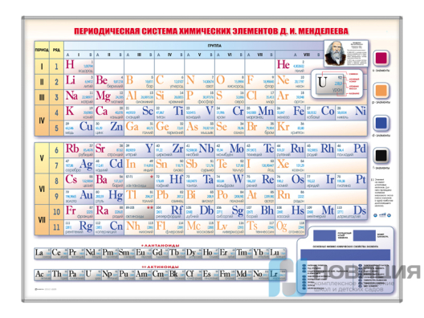

💡 **Как отличить главную подгруппу от побочной:** ориентир — линия от элементов 2-го периода. Символы, стоящие на этой линии, — главные подгруппы. Всё, что «рядом, но не на линии» (Cu, Ag в первой группе), — побочные.

### Как меняются свойства в периодической системе [tt:8:37:56]

⚡ **Группа свойств №1 — увеличиваются при движении к фтору (вправо и вверх):**

1. электроотрицательность;
2. неметаллические свойства;
3. окислительные свойства;
4. энергия ионизации и сродство к электрону;
5. **кислотные свойства оксидов и гидроксидов**.

⚡ **Группа свойств №2 (противоположная) — увеличиваются при движении к францию (влево и вниз):**

- металлические свойства, восстановительные свойства, **основные** свойства оксидов и гидроксидов.

**Атомный радиус:**

- **слева направо — уменьшается** (эффект сжатия: растут и заряд ядра, и число электронов → сильнее притяжение, оболочка сжимается);
- **сверху вниз — увеличивается** (добавляются новые уровни).

Отдельно: кислотные свойства **водородных соединений** — меняются по своим закономерностям (вниз по группе сила кислот растёт: HF < HCl < HBr < HI).

📝 **Практика 1.** Расположить C, Si, Mg в порядке **ослабления неметаллических** свойств. 💡 Лайфхак: переводим «ослабление» в «усиление металлических» (снизу вверх-влево). Ответ: **C → Si → Mg** (2, 1, 3): углерод ближе всех к фтору, магний — уже металл.

📝 **Практика 2. Атомный радиус.** Из Li, P, B, Cu, O выбрать три элемента **одного периода** (второго) и расположить в порядке уменьшения радиуса: **Li > B > O** (слева направо радиус уменьшается).

📝 **Практика 3. Основные свойства высших оксидов** (Mg, K, Cr): составляем формулы — MgO, CrO₃, K₂O. Увеличение основных свойств: **CrO₃ → MgO → K₂O** (CrO₃ вообще кислотный!). Ответ 3, 2, 5.

---

## 50. Базовая неорганика: химические свойства оксидов [tt:8:53:20]

> Правило-философия: «противоположности притягиваются» — основное с основным, кислотное с кислотным не реагирует. Большинство «пойдёт/не пойдёт» определяется тем, сильный реагент или слабый.

**1. Оксид + вода.** ⚡ Универсальное правило: **реакция идёт только если образуется растворимый продукт** (щёлочь).

- Na₂O + H₂O → 2NaOH (каустическая сода; реакция очень экзотермическая — пробирка может треснуть);
- CaO + H₂O → Ca(OH)₂ — 🔥 «негашёная известь» + вода = «гашёная известь» (важные тривиальные названия);
- CuO и другие оксиды, которым соответствуют **нерастворимые** основания, с водой не реагируют;
- 💡 MgO + H₂O → Mg(OH)₂ идёт при кипячении, но продукт — осадок, так что это «неудачный» пример (на ЕГЭ не дают);
- ⚠️ Ca(OH)₂ и Sr(OH)₂ в таблице растворимости помечены «М» (малорастворимы), но для ЕГЭ это **щёлочи** — считаем растворимыми.

**2. Основный оксид + основный оксид = ⊘.** Ничего не будет.

**3. Основный оксид + кислотный оксид.** ⚡ Правило: **хотя бы один оксид должен быть сильным** (сила оксида = сила соответствующего основания/кислоты).

- CuO (слабый, т. к. Cu(OH)₂ — осадок) + CO₂/SiO₂ (слабые) → ⊘;
- CuO + SO₃ (сильный, серная кислота) → реакция пойдёт;
- Основные оксиды щелочных/щёлочноземельных металлов — **всегда сильные**: реагируют с любым кислотным оксидом (и с сильным N₂O₅, и со слабым SiO₂):
  - Na₂O + SiO₂ → Na₂SiO₃ (силикат натрия);
  - CaO + N₂O₅ → Ca(NO₃)₂ (нитрат кальция; 💡 подсказка — подпишите под оксидом соответствующую кислоту, чтобы взять нужный анион).

**4. Амфотерный оксид** всегда **слабый** — требует сильного партнёра.

- Амфотерный + основный оксид щелочного/щёлочноземельного металла → идёт: в таких реакциях амфотерный оксид «притворяется кислотным» и уходит в **анион**.
  - Na₂O + ZnO → Na₂ZnO₂ (**цинкат** натрия);
  - CaO + Al₂O₃ → Ca(AlO₂)₂ (**метаалюминат** кальция). 💡 Амфотерные гидроксиды с тремя OH отщепляют воду: H₃AlO₃ (ортоалюминиевая кислота) → HAlO₂ (метаалюминиевая, более устойчивая) → анион AlO₂⁻.
- Амфотерный + основный оксид **другого** (слабого) металла → ⊘ (оба слабые).

**5. Основный оксид + кислота** → соль + вода, ⚡ но **хотя бы один реагент должен быть сильным**:

- MgO (слабый) + H₂S (слабая) → ⊘;
- CuO + HCl (сильная) → CuCl₂ + H₂O ✅;
- Основный оксид щелочного/щёлочноземельного металла + любая кислота (даже слабая H₂S) → идёт ✅.

**6. Оксиды + соли**, как правило, **не реагируют** (исключения — карбонаты и сульфиты, но не с основными оксидами).

**7. Оксид + кислород** — прочерк (переходы в пероксиды на ЕГЭ не рассматриваем).

**8. Оксиды + кислород (окисление оксидов):**

- Cu₂O + O₂ → CuO (медь «любит» +2, а +1 — не очень);
- запомнить устойчивые СО: у железа **+3**, у хрома **+3**, у марганца **+2**;
- амфотерные оксиды с кислородом **не реагируют**;
- кислотные оксиды — только если элемент **не в высшей** СО: 2SO₂ + O₂ → 2SO₃ (кат. V₂O₅); P₂O₃ → P₂O₅.
- ⚠️ **Никогда не пишите NO₂ + O₂ = N₂O₅** — такая реакция не идёт (не любой оксид можно окислить!).

### Амфотерные оксиды [tt:9:05:40]

- С **водой** — ⊘ (все амфотерные оксиды слабые);
- с основными оксидами щелочных/щёлочноземельных металлов — ✅ (было выше: Na₂ZnO₂, Ca(AlO₂)₂);
- с **кислотными** — только если кислотный оксид сильный (N₂O₅, SO₃): Al₂O₃ + N₂O₅ → Al(NO₃)₃, ZnO + SO₃ → ZnSO₄. Здесь амфотерный элемент идёт уже в **катион** (в соли нужен металл!);
- с **раствором щёлочи** и с **расплавом щёлочи** — реакции разные! (разбираем на Al₂O₃):
  - **раствор:** Al₂O₃ + 2NaOH + 3H₂O → 2Na[Al(OH)₄] — **комплексная соль**, тетрагидроксоалюминат натрия (лучше писать «4», как в ключах ЕГЭ; «6» тоже засчитают);
  - **расплав** (твёрдые вещества сплавляют в печи): Al₂O₃ + 2NaOH → 2NaAlO₂ + H₂O — **средняя соль**, метаалюминат натрия. Это не двойная соль: алюминий в анионе!
  - 💡 при уравнивании сначала уравнивайте всё, кроме водорода и кислорода — их считайте в последнюю очередь;
  - (в реальности реакция Al₂O₃ с раствором щёлочи не идёт, но на ЕГЭ её пишут часто).

### Кислотные оксиды [tt:9:12:00]

- **С водой** реагируют все, кроме **SiO₂** (вещества с атомной решёткой не растворяются в воде: алмаз, графит, песок).
- ⚡ Особый случай — **NO₂**: кислоты с N⁺⁴ не существует (есть HNO₂ для +3 и HNO₃ для +5), поэтому идёт диспропорционирование: 2NO₂ + H₂O → HNO₂ + HNO₃ (две кислоты сразу).
- С основными оксидами: ⚡ **хотя бы один оксид должен быть сильным** (правило работает всегда). Na₂O + N₂O₅ ✅, Na₂O + P₂O₅ тоже пойдёт (Na₂O сильный), а CuO + CO₂ — ⊘ (оба слабые).
- Кислотный + кислотный — ⊘, **но могут быть ОВР** (например, SO₂ с азоткой). 💡 ОВР «всё равно» на классификацию: важен только баланс степеней окисления.
- **Кислотный оксид + щёлочь** — идёт **всегда** с любым кислотным оксидом (щёлочь — сильный реагент). ⚡ С многоосновным оксидом всё зависит от **соотношения**:
  - NaOH (избыток) + CO₂ → Na₂CO₃ + H₂O (средняя соль);
  - NaOH (недостаток) + CO₂ (избыток) → NaHCO₃ (кислая соль).
- **Карбонаты и сульфиты + амфотерные/твёрдые кислотные оксиды** (реакции со звёздочкой, важны для второй части!):

> 💡 Смысл: **нелетучий оксид вытесняет летучий** (CO₂ или SO₂). Реакции идут при **сплавлении/нагревании**.

- Na₂CO₃ + ZnO → Na₂ZnO₂ + CO₂↑. Карбонат «образован» основным оксидом Na₂O и летучим CO₂; твёрдый ZnO вытесняет CO₂ и встаёт на его место. Соединяем Na₂O + ZnO → Na₂ZnO₂;
- Na₂CO₃ + SiO₂ → Na₂SiO₃ + CO₂↑;
- Na₂CO₃ + Al₂O₃ → 2NaAlO₂ + CO₂↑ (метаалюминат натрия);
- аналогично с сульфитами (в продуктах SO₂). ⚠️ Только **твёрдые** кислотные оксиды это умеют: SiO₂ и B₂O₃.
- 💡 Эти реакции любят давать в задании 7 — не «пролетайте» их по привычке «оксиды с солями не реагируют».

## 51. Практика: свойства оксидов [tt:9:19:35]

📝 **ОГЭ: что не реагирует с водой** (K₂O, Al₂O₃, SiO₂, SO₂): не реагируют **Al₂O₃** (амфотерный — слабый) и **SiO₂** (атомная решётка). Ответ 2, 5.

⚠️ SO₂ с водой формально реагирует, хотя кислота неустойчива: **считаем, что реакция идёт** (сильно смещена в обратную сторону, но в тестах — идёт).

📝 **Задание 7 (ЕГЭ): метод рассуждения, без перебора!** Шаг 1 — **классифицируем** каждое вещество и отмечаем силу (сильное/слабое), шаг 2 — отбрасываем заведомо невозможные варианты.

- **А) CO₂** (кислотный, слабый) — требует сильного партнёра → отбрасываем всё с амфотерными и слабыми; отбрасываем соли (кроме карбонатов/сульфитов) и азотку (окислять в CO₂ нечего — углерод и так в +4); остаётся сильное основание.
- **Б) CuO** (основный, слабый — соответствует осадок Cu(OH)₂) — отбрасываем все варианты со слабыми; вода не подходит, Ca(OH)₂ — основное с основным ⊘, а вот с **магнием** реакция пойдёт: Mg + CuO → MgO + Cu (магнийтермия — ОВР, восстановление меди). Остаётся один вариант.
- **В)** Сильное основание — отбрасываем всё основное и «слабое со слабым».

💡 В задании 7 цифры ответов могут **повторяться** — не удивляйтесь (например, один и тот же номер под Б и Г).

📝 **Задание 8: соответствие «исходные вещества → продукты».** Рассуждаем без перебора, через **шкалу степеней окисления**:

- **Fe₃O₄ + Fe → 3FeO.** Железо (0) и окалина (+8/3 — «между +2 и +3») идут навстречу друг другу и встречаются в промежуточной степени **+2**: получается FeO. 💡 Так же рассуждаем в ОВР: два вещества «с разных концов шкалы» дают промежуточную СО.
- **Na₂O₂ + CO₂ → Na₂CO₃ + O₂.** Пероксиды неустойчивы и диспропорционируют: Na₂O₂ → Na₂O + O (кислород); затем основный Na₂O + кислотный CO₂ → Na₂CO₃. 🔥 Применение: регенерация воздуха на подводных лодках и космических кораблях (таблетки из пероксида натрия).
- ⚠️ «Ловушка»: не выбирайте вариант, где в реакции есть простое вещество, но степени окисления не меняются по-настоящему.

## 52. Гидроксиды: щёлочи и нерастворимые основания [tt:9:47:26]

**Щёлочь + соль** (реакции ионного обмена) — ⚡ два условия одновременно:

1. добавляемая соль **растворима** (BaSO₄, AgCl — не подойдут);
2. в продуктах есть **признак**: осадок, газ или слабый электролит.

- CuSO₄ + 2NaOH → Cu(OH)₂↓ + Na₂SO₄ (осадок — признак ✅);
- NaCl + NaOH → ⊘ (всё растворимо, признака нет).

💡 Признак (газ/осадок/слабый электролит) нужен именно в реакциях **ионного обмена** — в ОВР или «оксид + оксид» его может и не быть.

**Щёлочь + простое вещество** — только ОВР, запоминалка:

> **«Только “псих” платит за щёлочь без налома»**: **П** — фосфор, **С** — сера, **И** — кремний, **Х** — галогены (Cl₂, Br₂, I₂), **Пла** — платина? Нет: **Be, Zn, Al** (амфотерные металлы).

Точнее: со щёлочью из простых веществ реагируют P, S, Si, галогены и амфотерные металлы (**Be, Zn, Al**) — всё это ОВР.

**Термическое разложение:**

- щёлочи термически стойки; исключение — **Ca(OH)₂ → CaO + H₂O** (встречается на ЕГЭ);
- **нерастворимые основания разлагаются все** (при нагревании): Mg(OH)₂ → MgO + H₂O; Cu(OH)₂ → CuO + H₂O; Fe(OH)₂ → FeO + H₂O.

**Сводная таблица: щёлочь vs нерастворимое основание**

| Реагент | Щёлочь | Нерастворимое основание |
|---|---|---|
| Основный оксид | ⊘ | ⊘ |
| Кислотный оксид | ✅ **любой** | ✅ **только сильный** |
| Амфотерный оксид | ✅ | ⊘ |
| Щёлочь | ⊘ | ⊘ |
| Кислота | ✅ **любая** | ✅ **только сильная** |

## 53. Амфотерные гидроксиды [tt:9:58:30]

Все амфотерные гидроксиды — **слабые** (им соответствует осадок), поэтому требуют сильного партнёра:

- **основные оксиды** — ⊘ (амфотерный + основный оксид формально возможен, но нужен нагрев, а при нагреве гидроксид разложится раньше → на ЕГЭ не дают);
- **кислотные оксиды** — ✅ только сильные (CO₂, P₂O₅ не подойдут);
- **щелочь** — ✅: в **растворе** — комплекс (Na[Al(OH)₄]), в **расплаве** — средняя соль (NaAlO₂);
- **кислоты** — ✅ только сильные (HCl, HNO₃, H₂SO₄);
- **соль**, **простые вещества** — ⊘;
- **термическое разложение** — ✅ идёт: 2Al(OH)₃ → Al₂O₃ + 3H₂O; 2Fe(OH)₃ → Fe₂O₃ + 3H₂O;
- амфотерный + амфотерный — ⊘.

## 54. Кислоты: химические свойства [tt:10:04:45]

- **с основным оксидом** → соль + вода; ⚡ хотя бы один реагент сильный (основный оксид щелочного/щёлочноземельного металла или сильная кислота);
- **с кислотным оксидом** — ⊘, но возможны **ОВР** (например, SO₂ с HNO₃);
- **с амфотерными гидроксидами и основаниями** (не щелочами) — только **сильными** кислотами;
- **со щёлочью** — ✅ **всегда**, с любой кислотой (даже с самой слабой — кремниевой!);
- **кислота + кислота** — странно, но возможны **ОВР** (H₂S + HNO₃(конц.));
- **с простыми веществами**: металл + кислота (классика) и ОВР HNO₃(конц.) с S, P, C, I₂;
- **термическое разложение**: H₂SiO₃ →(t°) SiO₂ + H₂O.

**Схема «кислота + соль»** — разбираем отдельно, по вариантам:

**Вариант А. Кислота + растворимая соль** — обязательно нужен **признак**: осадок, газ или малодиссоциирующее соединение (слабый электролит).

- H₂SO₄ + BaCl₂ → BaSO₄↓ + 2HCl;
- H₂SO₄ + Na₂CO₃ → Na₂SO₄ + CO₂↑ + H₂O;
- H₂SO₄ + 2KNO₂ → 2HNO₂ + K₂SO₄. 💡 Самые «проблемные» — именно случаи, где признак = слабый электролит (HNO₂): его не все замечают.

**Вариант Б. Кислота + нерастворимая соль.** Делим осадки на два вида:

| | Примеры | Растворяются в |
|---|---|---|
| **Обычные** осадки | CaCO₃, ZnS | обычных кислотах (HCl, разб. H₂SO₄) |
| **Суровые** осадки | AgCl, AgBr, AgI, BaSO₄, Ag₂S, HgS (и Ag₃PO₄) | только **HNO₃(конц.)**, да и то CuS и Ag₂S — в **ОВР** (окисляется сера) |

⚠️ AgCl, BaSO₄ и прочие «суровые» осадки на ЕГЭ **не растворяются ни в чём другом** — не пытайтесь их «растворить».

📝 **Практика (задание 7): Cr(OH)₃ + …**

- Cr(OH)₃ — амфотерный гидроксид, всё слабое → ищем сильное; CO₂ и SiO₂ слабые, H₂O не растворяет;
- с солями амфотерные гидроксиды не реагируют;
- остаётся **H₂SO₄** (сильная кислота) — вариант 1; для H₂S ищу сильное основное → Pb(NO₃)₂ (признак: осадок PbS); для щёлочи отбрасываю всё основное → остаётся вариант 4. Ответ: **1, 2, 4**.

📝 **Цепочка: Cu(OH)₂ →(t°) X →(+Y) Cu.** X = **CuO** (разложение нерастворимого основания на оксид и воду). Чтобы из Cu⁺² получить Cu⁰, нужен **восстановитель**: подойдут CO, H₂, C, Mg, Al (угарный газ тоже подойдёт — ОВР).

## 55. Кислые соли [tt:10:21:37]

Реакции **вытеснения летучего оксида** работают и с кислыми солями, но кислый водород нужно куда-то «пристроить» — дописываем **воду**:

- NaHSO₃ (или NaHCO₃) + SiO₂ → Na₂SiO₃ + SO₂(CO₂)↑ + H₂O (только твёрдые оксиды-вытеснители!);
- 2KHSO₃ + Al₂O₃ → 2KAlO₂ + 2SO₂ + H₂O (так же с ZnO — получаются цинкаты и алюминаты), водород снова «уходит» в воду.

⚡ **Кислая соль + щёлочь** — самое важное и «сыпучее» для ЕГЭ:

- **Щёлочь с тем же катионом** → из кислой соли получается **средняя соль + вода** (щёлочь отщепляет «кислый» водород): NaHCO₃ + NaOH → Na₂CO₃ + H₂O;
- **Щёлочь с другим катионом** — разбираем через **ионы в растворе**: NaHCO₃ + KOH: K⁺, Na⁺, OH⁻, HCO₃⁻. Реакция идёт через взаимодействие кислого водорода аниона с OH⁻: HCO₃⁻ + OH⁻ → CO₃²⁻ + H₂O. Сначала пишем **две средние соли**: K₂CO₃ + Na₂CO₃ + H₂O;
- ⚠️ **но проверяем побочные реакции!** K₂CO₃ + Ca(OH)₂ → CaCO₃↓ + 2KOH — **если щёлочь в избытке**, карбонат калия не «доживёт». Поэтому:
  - щёлочь **в избытке**: KOH + CaCO₃ (основание + средняя соль);
  - щёлочь **в недостатке**: K₂CO₃ + CaCO₃ + H₂O (две средние соли).
- 💡 **Алгоритм для «кислая соль + другая щёлочь»:** (1) выпишите ионы в растворе; (2) найдите взаимодействие H⁺(кислого аниона) с OH⁻; (3) напишите средние соли + воду; (4) проверьте, что будет, если щёлочь в избытке окажется рядом с продуктами.
- 🔥 Это **классические ловушки задания 30** (и в этом, и в прошлые годы таких реакций было очень много) — отдельно отработать!

### Лайфхак: гидросульфаты [tt:10:28:10]

⚡ **NaHSO₄ — единственная кислая соль, образованная сильной кислотой!** Все остальные (гидрокарбонаты, гидрофосфаты…) — от слабых.

💡 Воспринимайте NaHSO₄ **как серную кислоту**: подумайте, как повела бы себя H₂SO₄, и допишите натрий отдельным продуктом:

- CuO + NaHSO₄ → CuSO₄ + Na₂SO₄ + H₂O (мысленно: CuO + H₂SO₄, плюс Na₂SO₄ как побочный продукт);
- Na₂S + 2NaHSO₄ → 2Na₂SO₄ + H₂S↑ (серная разбавленная, без ОВР).

## 56. Комплексные (координационные) соединения [tt:10:35:05]

Разбираем логику, а не заучиваем: **сначала диссоциация на внешнюю и внутреннюю сферу**, потом смотрим, какие ионы в растворе.

- K₂[Zn(OH)₄] → 2K⁺ + [Zn(OH)₄]²⁻ (внутренняя сфера не распадается).
- **Кислота в недостатке** (HCl): H⁺ реагирует с комплексным анионом — «вытаскивает» OH-группы (по зарядам: [Zn(OH)₄]²⁻ + 2H⁺): [Zn(OH)₄]²⁻ + 2H⁺ → Zn(OH)₂↓ + 2H₂O. В растворе остаётся KCl:
  K₂[Zn(OH)₄] + 2HCl → Zn(OH)₂↓ + 2KCl + 2H₂O.
- **Кислота в избытке**: сильная кислота растворяет амфотерный гидроксид: Zn(OH)₂ + 2HCl → ZnCl₂ + 2H₂O, итого: K₂[Zn(OH)₄] + 4HCl → ZnCl₂ + 2KCl + 4H₂O. С алюминием всё так же: K[Al(OH)₄] + 4HCl → AlCl₃ + KCl + 4H₂O.

**Слабые кислоты (CO₂, SO₂, H₂S) и комплексы:**

- CO₂ в растворе даёт немного H⁺ и HCO₃⁻ — старт тот же, с протона;
- [Al(OH)₄]⁻ (заряд −1) → достаточно одного H⁺: [Al(OH)₄]⁻ + H⁺ → Al(OH)₃↓ + H₂O, а оставшийся калий «подбирает» HCO₃⁻: K[Al(OH)₄] + CO₂ → Al(OH)₃↓ + KHCO₃;
- 💡 **Совет:** со слабой кислотой (`CO₂`, `SO₂`, `H₂S`) **всегда пишите кислые соли** (KHCO₃, KHS, KHSO₃) — так никогда не ошибётесь, и в ключах это всегда пройдёт; тем более в условии может быть «избыток газа пропустили через раствор».

**Комплексы и слабые кислоты (H₂S):**

- С комплексом **алюминия** логика та же, что с CO₂: K[Al(OH)₄] + H₂S → Al(OH)₃↓ + KHS + H₂O;
- ⚠️ **А вот цинк ведёт себя «не как алюминий»**: по аналогии хочется написать Zn(OH)₂, но в реальности образуется **ZnS**. Сравниваем растворимости: ZnS растворяется **намного хуже**, чем Zn(OH)₂, а в химии **выгоднее тот осадок, который хуже растворяется** (меньше произведение растворимости). K₂[Zn(OH)₄] + 3H₂S → ZnS↓ + 2KHS + 4H₂O.

## 57. Скорость химической реакции [tt:10:46:08]

**Увеличивают скорость:**

- **измельчение** твёрдого вещества (больше площадь соприкосновения; ассоциация: сахар-рафинад против сахарного песка);
- **повышение температуры**;
- **повышение концентрации реагентов**;
- **повышение давления** — но только если **газ есть слева** (сжимаются только газы!);
- катализатор.

**Уменьшают скорость:** ингибитор (он замедляет — не путайте с катализатором), понижение температуры, разбавление (добавление воды снижает концентрацию ионов), уменьшение концентрации реагентов.

⚠️ **Газ в продуктах на скорость не влияет!** Давление меняет скорость только через газообразных **реагентов** (слева).

📝 **Задача 1 (Fe + O₂):** увеличивают скорость — **измельчение железа** и **повышение давления** (кислород — газ). Ингибитор, ↓ концентрации O₂, ↓ температуры — нет. Ответ 2, 3.

📝 **Задача 2 (карбонат + сильная кислота, узнаём по H⁺):** уменьшают скорость — **понижение температуры**, **добавление воды** (разбавление) и **уменьшение концентрации кислоты**. Индикатор не влияет; понижение давления не влияет, потому что CO₂ — **продукт**. Ответ 1, 2, 4.

## 58. Химическое равновесие [tt:10:50:09]

**Равновесие** — состояние, когда скорости прямой и обратной реакций равны, а концентрации всех участников постоянны. Управлять равновесием важно для промышленности (синтез аммиака, метанола и др.).

Разбираем на N₂ + 3H₂ ⇄ 2NH₃ (прямая — экзотермическая, обратная — эндотермическая; катализатор — пористое железо):

| Воздействие | Смещение равновесия |
|---|---|
| ↑ концентрации **реагентов** | вправо (в сторону продуктов) |
| ↓ концентрации реагентов | влево |
| ↑ концентрации **продуктов** | влево |
| ↓ концентрации продуктов | вправо |
| ↑ температуры | в сторону **эндотермической** (здесь — влево) |
| ↓ температуры | в сторону **экзотермической** (здесь — вправо) |
| ↑ давления | в сторону **меньших молей газа** (здесь 4 → 2, вправо) |
| ↓ давления | в сторону больших молей газа |
| ↑ объёма (= ↓ давления) | в сторону больших молей газа |
| ↓ объёма (= ↑ давления) | в сторону меньших молей газа |
| катализатор | **не смещает никогда** (ускоряет обе реакции одинаково) |

💡 Температура: «**минус идёт в плюс**». Повышение T = «+Q» — притягивается к эндотермической стороне (−Q); понижение T = «−Q» — к экзотермической (+Q), где записан «+Q».

💡 Давление и объём: **обратная связь** (поршень: давим сильнее — объём меньше). Запоминалка: «**в маленькой квартирке легче жить маленькой семье**» — под давлением (мало места) выгоднее меньшее число молей газа.

⚠️ Давление влияет, только если в системе **есть хотя бы один газообразный участник** (неважно, слева или справа).

## 59. Практика: химическое равновесие, задание 22 [tt:11:09:36]

⚡ **Алгоритм работы с твёрдым веществом** (частая ловушка линии 22):

1. Реакция идёт **в растворе**? (есть вода/H⁺ и т. п.)
2. То, что вы добавляете, **растворимо**?

Если хотя бы на один вопрос ответ «нет» — твёрдое вещество на равновесие **не влияет**.

Если «да» и «да»:

3. Напишите **диссоциацию** того, что добавляете, и посмотрите, **есть ли эти ионы уже в уравнении**;
4. Если ион уже есть среди реагентов — его концентрация растёт → равновесие в **правую** сторону.

Разбор:

- добавление **KHS**: диссоциация даёт K⁺ и **HS⁻**, а HS⁻ уже стоит слева (реагент) → концентрация реагента растёт → **вправо** (ответ 1);
- **повышение давления**: газообразных участников нет → не влияет (ответ 3);
- **понижение температуры** = «−Q» тянется к «+Q», а «+Q» справа (экзотермическая прямая) → **вправо** (ответ 1);
- добавление **твёрдого KOH**: OH⁻ связывает H⁺ в **воду** (слабый электролит, обратно не распадается) → концентрация H⁺ резко падает → **влево** (ответ 2).

💡 «Классика» задания 22: взаимодействие добавленного OH⁻ с H⁺ из уравнения.

## 60. Химия элементов: активность металлов и неметаллов [tt:11:14:20]

💡 Главное правило то же, что и в базовой неорганике: **хотя бы один участник должен быть активным**.

- **Самые активные неметаллы — VII группа (галогены)**: реагируют практически со всеми (лишь йод иногда «чудит»);
- **Самые активные металлы — I группа (щелочные)**, II группа чуть уступает;
- при работе с таблицей «металл × реагент» начинаем расставлять «плюсики» именно с этих групп — они реагируют со всем.

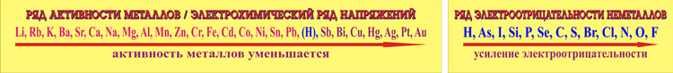

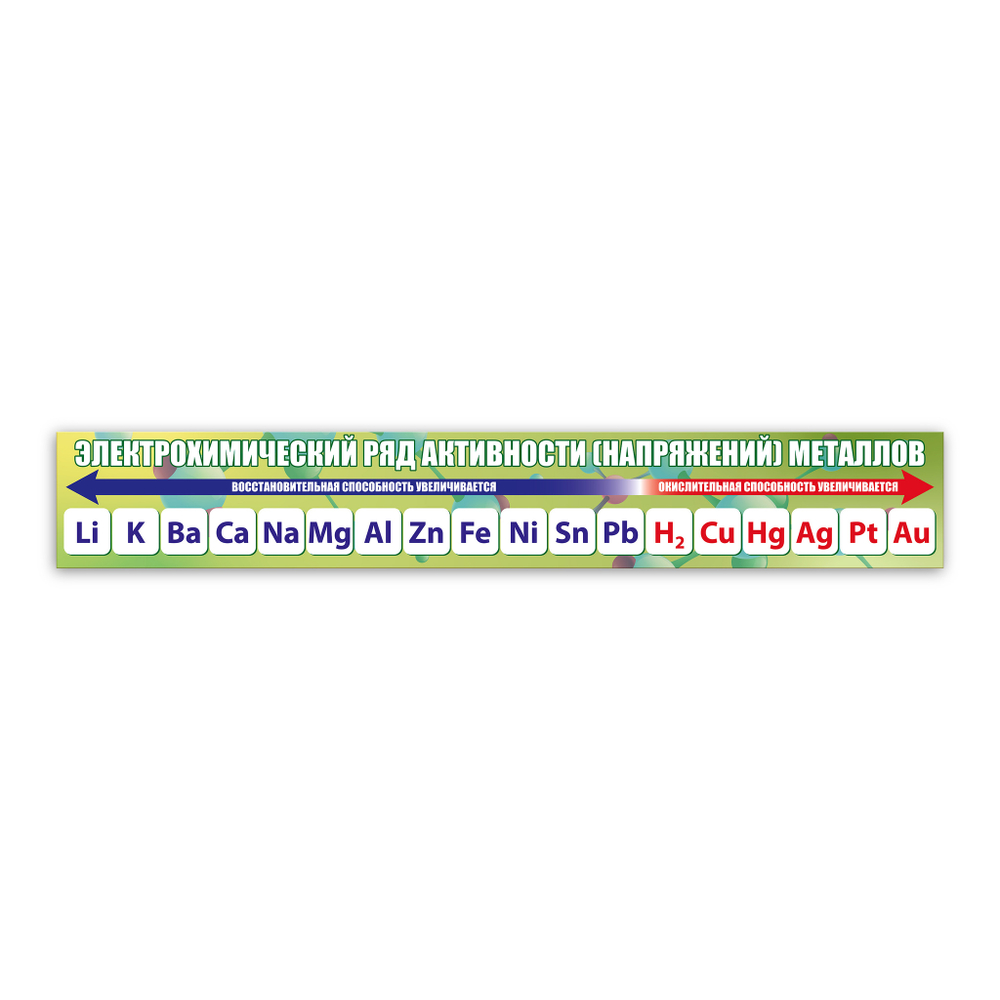

⚠️ В химии элементов **больше исключений и нетипичных реакций**, чем в базовой неорганике, — не зубрите, впитывайте через практику («наращивайте понимание»).

### Щелочные и щёлочноземельные металлы

- **С водородом:** щелочные и щёлочноземельные реагируют (образуются гидриды), Mg — тоже (MgH₂), а вот **Al и все, кто дальше, с водородом не реагируют** (AlH₃ на ЕГЭ не дают!);
- ⚠️ **щелочной металл + раствор кислоты** — «плюс и вопрос»: натрий в растворе будет реагировать **в первую очередь с водой**, а не с кислотой, поэтому такие реакции на практике не проводят;
- **с галогенами** — реагируют все;
- **с кислородом (при горении!):**

| Металл | Продукт горения |
|---|---|
| **Li** | оксид Li₂O |
| **Na** | пероксид Na₂O₂ |
| **K** | надпероксид KO₂ |

(оксиды K и Na существуют, но получают их **другим способом**);

- щёлочноземельные с кислородом дают **только оксиды** — не надо придумывать пероксиды;
- с водой щелочные и щёлочноземельные реагируют бурно (замещение, выделяется H₂), Mg — при высокой температуре (яркая белая вспышка), Al — только если снять **оксидную плёнку** (в быту алюминиевая посуда не растворяется именно из-за неё).

### d-металлы (Cr, Fe, Cu, Zn)

- **С кислородом:** Zn → ZnO; Cr → Cr₂O₃; ⚡ **Fe → Fe₃O₄ (окалина!)** — только так, никаких FeO и Fe₂O₃; Cu → CuO или Cu₂O (оба варианта допустимы);
- **С водой:** металлы средней активности (от Zn до Pb) реагируют только при **высокой температуре (красное каление)**, и продукт — всегда **оксид**, а не гидроксид (гидроксиды при такой температуре не выживают): Zn + H₂O → ZnO + H₂; Cu и металлы после водорода — ⊘;
- **со щелочами:** Be, Zn, Al — ✅ (амфотерные), Cr, Fe, Cu — ⊘;
- **с кислотами (HCl):** Mg и Al — уверенно ✅; Fe + HCl → **FeCl₂** (не FeCl₃!); Cr + HCl → CrCl₂, хотя Cr²⁺ — сильный восстановитель и в присутствии кислорода может окисляться до Cr³⁺ (хром «очень хочет» до своей устойчивой +3);
- **с галогенами:** Cr + Cl₂/Br₂/I₂ → Cr⁺³ (CrCl₃ и т. д.); Fe + Cl₂/Br₂ → FeCl₃, FeBr₃; ⚡ **исключение с йодом:** Fe + I₂ → **FeI₂**, потому что Fe³⁺ окисляет иодид-ион (I⁻ → I₂, Fe³⁺ → Fe²⁺), поэтому «FeI₃» писать нельзя (в таблице растворимости у него прочерк); Cu + I₂ → **CuI** (йодид меди(I)) — йод как слабый окислитель даёт «непривычные» продукты.

## 61. Шпаргалка: шкала степеней окисления кислорода [tt:11:41:07]

| СО кислорода | Класс соединений | Пример |
|---|---|---|
| **−2** | оксиды | Na₂O |
| **−1** | пероксиды | Na₂O₂ |
| **−½** | надпероксиды (супероксиды) | NaO₂ |
| **0** | простое вещество | O₂ |
| +1, +2 | фториды кислорода | OF₂ |

💡 Самые **устойчивые** СО — **−2 и 0**: их соединений в природе больше всего (вода и кислород). «Что широко распространено — то и устойчиво» → в реакциях старайтесь приходить к −2 или 0.

**Как шкала помогает писать реакции:**

- ← движение **влево** (понижение СО) = **добавляем натрий**: Na₂O₂ + 2Na → 2Na₂O;
- → движение **вправо** (повышение СО) = **добавляем кислород**: Na₂O₂ + O₂ → 2NaO₂ (надпероксид), из оксида и надпероксида «навстречу» получается пероксид: 2Na₂O + 2NaO₂ → 3Na₂O₂.

💡 «Ближнее с ближним, дальнее с дальним» — по шкале видно, в какую сторону идёт реакция и что получится.

## 62. Электролиз [tt:11:39:03]

**Электролиз** — окислительно-восстановительная реакция **расщепления под действием электрического тока** (сравните: гидролиз — расщепление водой). Идёт в **расплавах и растворах**.

- Позволяет провести реакции, которые в обычных условиях **не идут никогда**;
- способ получения **чистых** веществ (металлов, неметаллов);
- фишка: процессы **окисления и восстановления разделены** — анионы и катионы «работают» на разных электродах.

**Устройство электролизёра:**

- **анод** — заряжен положительно, туда устремляются **анионы**;
- **катод** — заряжен отрицательно, туда идут **катионы**.

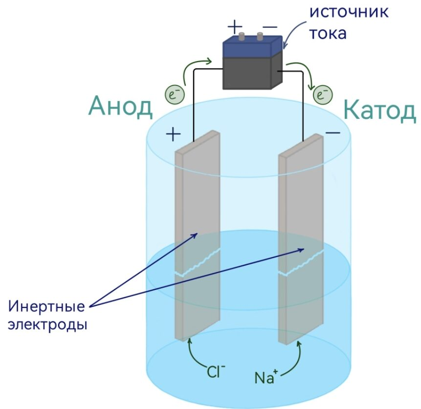

⚠️ В **растворе** всегда есть ещё и **вода**: её связи сильно полярны, молекула — **диполь** (отрицательный полюс — кислород, положительный — водород). Вода «липнет» и к катоду (положительным полюсом), и к аноду (отрицательным) — поэтому всегда возникает вопрос: **кто именно будет реагировать на электроде — вода или ион?**

**Что происходит на электродах (в растворе — «ион против воды»):**

**Катод (−), восстановление** (мнемоника: **к**атод, **к**атионы, **в**осстановление — согласные), смотрим на **ряд активности**:

| Металл в растворе | Что восстанавливается на катоде |
|---|---|
| **активный (до Al включительно!)** | **вода** → выделяется H₂ |
| **малоактивный** (Cu, Ag, Au, Hg) | сам **металл** |
| **средней активности** (Fe, Cr, Zn…) | ⚡ **оба процесса одновременно** (и металл, и H₂) — параллельно, не по очереди! |

⚠️ **Al — ключевая ловушка:** в этой теме алюминий — **активный** металл (каждый год на нём теряют баллы: в разных темах его относят то к активным, то к среднеактивным).

**Анод (+), окисление** (мнемоника: **а**нод, **а**нионы, **о**кисление — гласные), смотрим на **состав аниона**:

- **кислородсодержащий** анион (и F⁻) → окисляется **вода** (выделяется O₂);
- **бескислородный** анион (Cl⁻, Br⁻, I⁻, S²⁻) → выделяется **простое вещество** (Cl₂, Br₂, I₂, S);
- **OH⁻** — особый: уравнение записывают без H⁺ (в щелочной среде протонов быть не может), но смысл тот же: кислород −2 → 0.

**Примеры:**

**Электролиз расплавов** (воды нет — конкуренции нет, всё «распадается» на простые вещества):

- 2NaCl (расплав) → 2Na + Cl₂;
- ⚡ NaOH (расплав): нельзя писать «Na₂O» — было бы три перехода СО. На катоде Na, на аноде окисляется кислород, а водород остаётся в +1 → дописываем воду: 4NaOH → 4Na + O₂ + 2H₂O;
- 2Al₂O₃ (расплав) → 4Al + 3O₂.

**Электролиз растворов:**

- NaCl (раствор): Na — активный → на катоде **H₂**; анион бескислородный → на аноде **Cl₂**; в растворе появляются OH⁻, которые связываются с Na⁺ → **NaOH** как побочный продукт;
- KBr (раствор): H₂, Br₂, KOH;
- CuCl₂ (раствор): Cu — малоактивный → на катоде **Cu**; анион бескислородный → на аноде **Cl₂**; вода вообще не участвует (так тоже бывает!).

⚠️ Электролиз — **самая распространённая тема задания 34** (расчётные задачи второй части), поэтому требует отдельной отработки.

---

## 63. Финал стрима [tt:11:54:00]

Лектор закрывает трансляцию (YouTube останавливает эфир после 12 часов):

- благодарит всех, кто досмотрел до конца — «это было очень жёстко»;
- просит написать в комментариях, понравилось ли, и выбрать следующие темы: **органика** или **задание 34**, либо что-то ещё;
- напоминает про QR-код розыгрыша и ссылки: `prfmtk.ru`, Telegram `t.me/profimatika_chem`, ВК `vk.ru/profimatika_chemistry`, банк заданий `bank-zadach.ru`.

**Итог урока:** за 12 часов разобраны основы химии и вся **базовая неорганика** — от строения атома, валентности и степени окисления до оксидов, гидроксидов, солей, растворов, периодического закона, скорости, равновесия, металлов и электролиза. **Органика**, а также термохимия и гидролиз, из-за лимита времени остались на следующие стримы — лектор обещал записать их отдельно.

---

*Конспект завершён. Спасибо, что дочитали! 💚*
